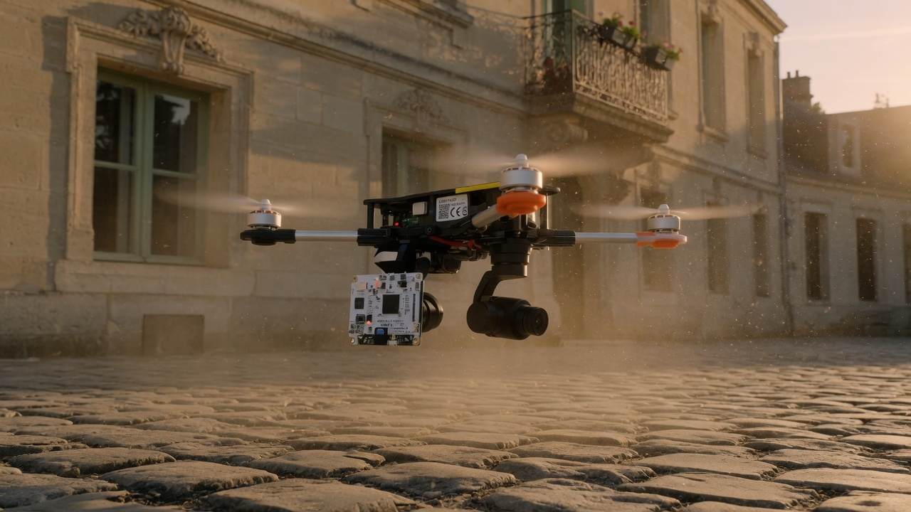
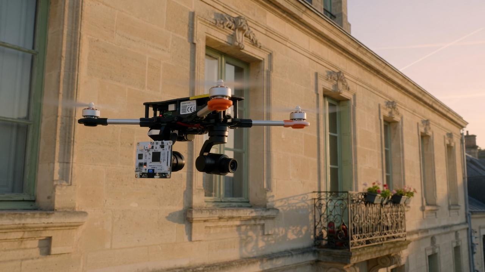
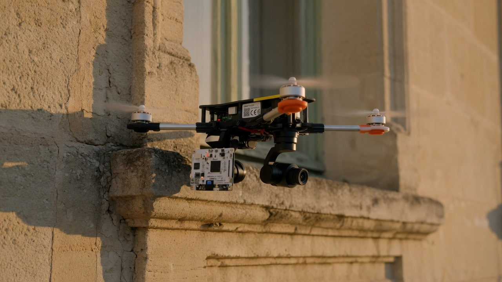
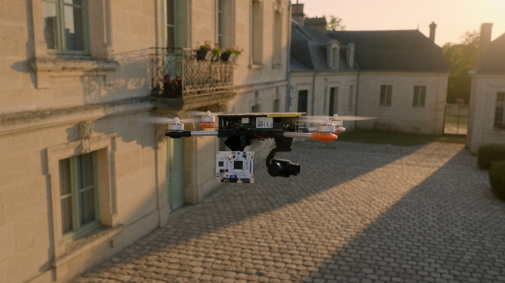
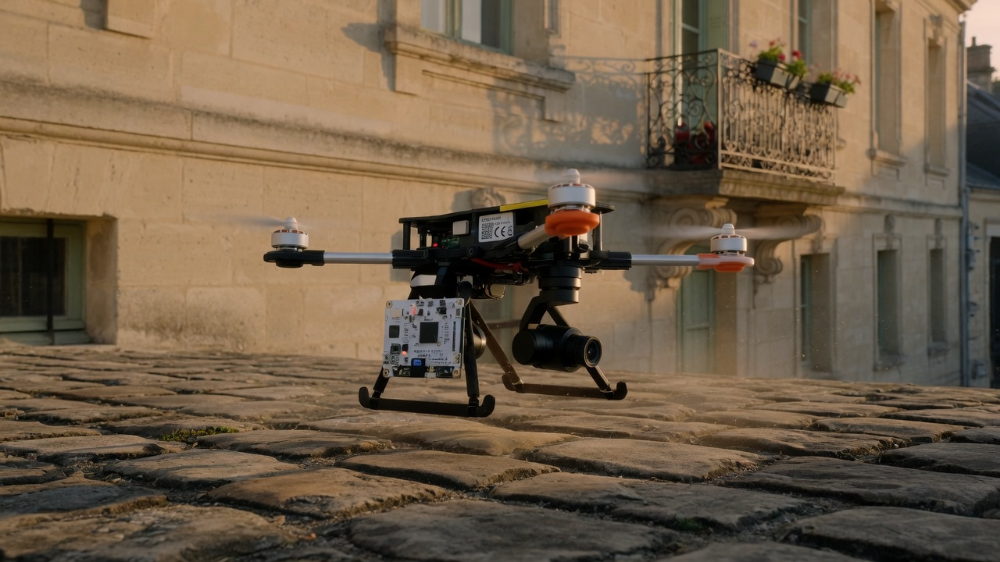

# ID01 — scenario A beat cards

Optional stills that name the five scenario-A beats. They are **not** a speed, a
duration, a 6-DoF plant, or Thread truth. Do not infer airspeed from a generated
image or clip.

Duration method (project r785): `measured-representative-workflow`.
Inspection speed: sourced band 1–3 m/s, hypothesis H1 = 2 m/s to **test** — see the
scenario-A sheet. Stills do not supply `v`.

| Beat | Still |
| ---- | ----- |
| 1 Launch and climb |  |
| 2 Short approach |  |
| 3 One local façade zone |  |
| 4 Direct return |  |
| 5 Land |  |
