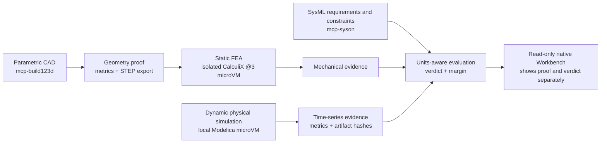

# Explanation: why proofs and verdicts are separate

Audience: both · Diátaxis: explanation · Kind: contract

> **Diátaxis category: explanation.** This page explains the architectural boundary. For
> file locations, use the [building-block reference](../../reference/providers/building-blocks.md).

A tool succeeding means it completed the work it owns. It does not mean a product is
compliant. Geometry, FEA, and dynamic simulation answer different physical questions; a
requirement/constraint evaluation decides whether a named condition is satisfied by
named, unit-bearing evidence.

## Four questions, four owners

| Question                                                                                 | Owner                                | A successful response proves                                                               | It does not prove                                                                          |
| ---------------------------------------------------------------------------------------- | ------------------------------------ | ------------------------------------------------------------------------------------------ | ------------------------------------------------------------------------------------------ |
| What shape, volume, mass, or export was produced?                                        | `mcp-build123d`                      | A parametric geometry execution and its exact geometry/export evidence.                    | Local stress, transient behaviour, or requirement compliance.                              |
| Does this geometry withstand a stated static load model?                                 | Isolated CalculiX `@3` local microVM | A mesh/solver result for that geometry, load case, material assumptions, and solver setup. | That the CAD is the only valid design or that an unrelated requirement passed.             |
| What happens over time in coupled thermal, hydraulic, electrical, and control behaviour? | Local Modelica microVM               | A versioned admitted or kit run, observations, and hashed artifacts.                       | A SysML requirement verdict; its `succeeded` run intentionally has no `pass`/`fail` field. The port 3016 `mcp-modelica` sidecar is retired. |
| Is a named, unit-bearing condition satisfied by supplied evidence?                       | `mcp-syson` and the constraint layer | A comparison with the condition, values, units, and margin visible.                        | That the input evidence is broader, newer, or more applicable than its provenance says.    |

This separation prevents a common but dangerous shortcut: treating a green solver exit
code as a product claim. A solver is authoritative about its own execution and result.
It is not authoritative about the business meaning, scope, identity, unit conversion, or
traceability of a requirement.

## A verdict is a join, not a field added by a solver

To make a verdict, the evaluator needs all of the following:

- a named constraint or requirement, including its expression and units;
- evidence whose metric identity and units are understood;
- provenance tying the evidence to the model, scenario, geometry, load case, artifacts,
  and versions that were actually used;
- a policy for insufficient or incompatible evidence.

The result may be `passed` or `failed`, but it may also be `unresolved` or `error`.
Those latter states are evidence that the comparison could not be made reliably, not
concealed successes. Keeping this result in a separate stage makes its inputs
inspectable and prevents accidental reuse of a verdict for a merely similar run.

## The join is enforced, not merely intended

The third bullet above — provenance tying the evidence to what was actually used — is
the one an implementation is most likely to believe it satisfies. The first real
mechanical runs, on 2026-08-10, showed what that costs in practice.

The verdict artifact declared three inputs and drew three derivation links, but only one
of them carried an attestation: the solver's, on the STEP it had hashed. The other two
were _asserted_ derivations — the graph said the verdict came from the sealed proof case
and the sealed requirements, and nothing recorded that anyone had read them. The
snapshot was refused. So was a subtler one: the evaluation named the requirement by the
identifier local to the reviewed JSON file rather than the identifier the thread had
given it when extracting it from the sealed artifact. It read plausibly and it evaluated
nothing.

Neither defect could have surfaced from unit tests, because both executors _built_ their
objects correctly. What they had never done is publish. Constructing a valid object and
producing a publishable graph are different claims, and only the second is a verdict.

The practical consequence is that an operation which has never run against
`validateThreadSnapshot` should be described as untested regardless of its test count —
a distinction worth keeping while the simulation path still awaits its first real run.

## Why MCP Apps do not collapse the boundary

`mcp-server` transports tools and resources using the stateless `2026-07-28` contract.
The Console MCP tools observe those stages read-only (`console_snapshot`). The native
Workbench renders one linked `ThreadSnapshot` through trusted local React components.
A provider result-viewer is not the atelier product page.

None of these presentation or transport layers may turn an evidence payload into an
unstated verdict. A view can make the relationship legible—stage, metric, limit, margin,
hashes, and provenance—but it cannot supply missing requirements, infer a unit, or
override an `unresolved` state. Presentation is useful for navigation and review but is
not itself the engineering authority.

## Structured results make the separation usable

A v1 `structuredContent` envelope gives the view an explicit, testable contract instead
of requiring it to scrape human text. The Modelica example has a `schemaVersion: "1.0"`,
a `kind`, and a run payload; a comparison is another typed stage with its own status and
provenance. This supports standard views without normalising away domain meaning:

- a CAD viewer can show dimensions and exported artifacts;
- an FEA viewer can show load assumptions and solver evidence;
- a Modelica viewer can show metrics and time-series artifacts;
- a verification view can show the exact condition, units, margin, and result.

The common rendering shell is not a common physical model or a universal verdict schema.
Standardise the transport and visible evidence discipline; keep calculation semantics
with the server that owns them.
