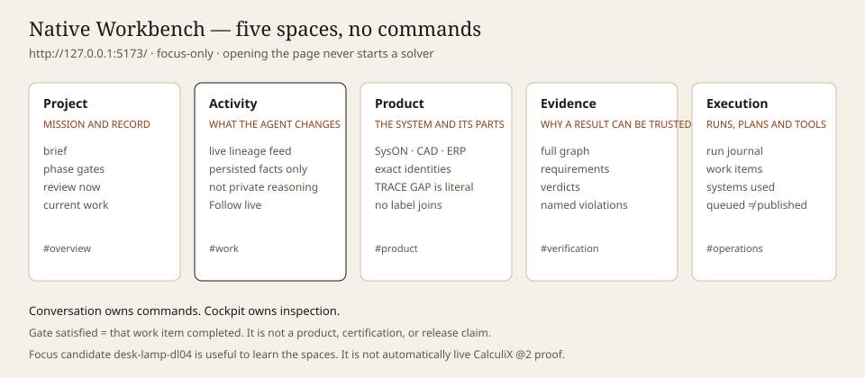

# Native digital-thread Workbench: compose evidence, not applications

Audience: both · Diátaxis: explanation · Kind: explanation

**Status: accepted target — native schema-3.0 project cockpit, generic documentary/
SysON bootstrap, focus-only project selection, and isolated proof `@3`**

The first Workbench proved that five independent MCP Apps can be discovered,
capability-bounded, mounted, and synchronized. It also exposed the product limit of that
architecture: five isolated applications remain five isolated applications even when
they share colors and small reusable components.

The product Workbench does not use a nested multi-App dashboard as its main composition
primitive. It renders one linked engineering state in one native React + Vite shell.
Domain presentations, however, are no longer reimplemented in that shell: an exact whole
MCP App can open on demand as a floating window on the Project whiteboard. MCP remains
the protocol between the separately composed App host and its provider.

## Product question

The Workbench is a multi-tool cockpit in which an engineer works with an agent. It must
answer three questions at the same time:

1. What did the agent just produce or change?
2. What does that fact affect across the engineering chain, and why?
3. Which prepared recommendation should the person discuss or confirm next in the paired
   conversation?

Those questions share one evidence model but must not compete visually. The beginner
view leads with current project stage, agent activity, and the next review. Technical
lineage and provider records appear progressively when the person selects the affected
fact. The product may start from an idea, existing CAD, or an existing product; those
entry points converge on the same change-to-proof loop described in
[the product direction](../product/product-direction.md).

The primary UI object is therefore a change and its propagation, not an MCP server or a
dashboard panel. The activity feed is the chronological backbone of the cockpit, not the
whole product: its inline lineage explains impact, and the contextual tool surface is
where the engineer inspects records. Control remains in the paired conversation.

```text
CAD change
  -> invalidates a structural solve
  -> produces a unit-bearing stress observation
  -> evaluates a traced requirement
  -> creates a named violation with evidence and a next action
```



The Workbench renders that topology first as a live lineage feed and second as a
complete graph. Feed cards are meaningful canonical facts; selecting or automatically
following a card renders every recorded ancestor and descendant as an inline scoped
graph. Nodes are canonical changes, artifacts, consumptions, observations, requirements,
evaluations, violations, and proposed actions. Edges retain their semantic relation and
factual rationale. Visual direction is consistently source or dependency to result or
consumer.

The graph does not join branches by name. A disconnected component is rendered in a
separate frame and means that the subject identity is shared but no causal relation has
been recorded.

The shell must never imply more autonomy than the runtime provides. A live indicator
means that validated persisted revisions are being followed, not that raw model
reasoning is being streamed. Browsing and inspection are immediate. Human decisions are
explicit, revision-bound confirmations elicited by MCP in the paired conversation;
engineering tool execution is a separate bounded agent operation with recorded inputs
and evidence.

The default human role is reviewer, not technical payload author. Decision states have
different owners in the UI: `required` means the agent is preparing a recommendation,
`proposed` means the conversation has a review question, and `rejected` means the agent
owes a revision. **Project** exposes a lightweight notification view: it signals what
needs attention and leads the reviewer to the relevant context; it is neither a command
surface nor a second technical authoring surface. **Activity** is where the reviewer
follows the live evidence and lineage behind a recommendation. Inspection and any
correction request start with the affected exact record in **Activity** or **Evidence**,
or with its one registered whole App reached through **Product** and the Project
whiteboard. The paired agent conversation remains the only decision surface. Activity
only reflects the resulting immutable state; exact hashes and snapshot IDs remain
available as audit context.

## Runtime boundary

```text
native React + Vite SPA                     paired agent MCP client
  | GET + snapshot SSE                       | propose / elicit / queue / execute
  | no command authority                     | bounded registered operations only
  v                                          v
                 immutable EngineeringProject revisions
                              |
                              | registered executors (not the frozen YAML DAG)
                              v
                  Digital-thread orchestrator
                  - code-owned operation registry
                  - artifact fingerprints
                  - provenance and run state
                  - linked ThreadSnapshot
                              |
                              | server-owned sequence
                              v
       SysON / build123d / CalculiX / Modelica / ERPNext
       or an independently qualified local microVM
```

Opening or refreshing the application reads persisted project and thread snapshots. It
never starts CAD, meshing, FEA, or physical simulation. The read and SSE paths remain
passive. A provider recomputation is a separately orchestrated agent action with an
identified change set, durable run state, and provenance.

The current BFF serves the focused durable project and a same-origin SSE stream which
announces newer persisted revisions. It has no default project or fallback: without
durable focus or an explicit project ID it reports awaiting project context. The BFF
exposes no product command or provider-execution authority. Human intent enters through
the paired conversation and consequential decisions are bound to exact revisions through
signed MCP elicitation.

The same project is visible to agents through the Console MCP server. MCP exposes
snapshot, proposal, signed human approval or rejection elicitation, append-only project
changes, server-derived queueing, and narrow execution of registered V3 operations. The
human never supplies tool names or solver payloads, and the agent cannot confirm its own
proposal. Every accepted command converges on one immutable active store with optimistic
revision checks and durable idempotency receipts.

For a new idea/specification project, `baseline.from-approved-brief@1` creates a
SHA-256-addressed immutable document of the exact human-approved living brief and
reviewed plan: documentary `ThreadSnapshot` r1. The cockpit can show its queue, redacted
live milestones, and resulting provenance without presenting it as a technical graph.
This documentary baseline is deliberately pre-technical: it is not a SysML model, CAD
artifact, FEA/simulation result, measurement, requirement verdict, or conformity claim.

The first implemented provider-backed V3 operation, `architecture.seed-syson-model@2`,
is intentionally just as narrow. After an append-only project change has named exact
documentary r1, its server-fixed executor creates a blank SysON project container, blank
SysML document, and root package, then reads the root package back. The
`syson-model-seed-capture/2.0` binds normalized provider identities to the exact
approved brief, documentary artifact, and project change before immutable r2 is
published. The live activity is a small closed sequence, not a generic SysON viewer; the
agent cannot supply a provider, tool, arguments, SysML text, or result. Each
non-idempotent creation is durably recorded before dispatch, so an unknown outcome stops
for review instead of being blindly retried. r2 proves only the editable container
identity: it is not a system architecture, requirements, CAD, simulation, measurement,
or a verdict.

The generic route continues beyond r2 only through separately registered operations for
reviewed architecture, requirements, geometry, proof sealing and isolated CalculiX `@3`.
Each operation must publish and reread its own exact descendant `ThreadSnapshot`; no
earlier project or superficially similar artifact can satisfy completion.

The browser does not call the five MCP endpoints directly. The Deno backend owns service
endpoints, credentials, workflow execution, and result validation. Provider tools keep
their native contracts; normalization happens only when a result is added to the linked
thread model.

## Presentation boundary

The product cockpit is a React + Vite SPA (`native-preview.tsx` mounts
`ThreadWorkbench`). Presentation primitives live in `src/ui/src/ui/*`. A local token
copy (`src/ui/src/view/mcp-view-theme.ts`) holds `--cockpit-*` and `.cockpit-surface`;
leftover `.mcp-view-*` class rules were retired. The native bundle must not import
`@casys/mcp-view`, hydrate MCP tool results, advertise MCP server capabilities or
contain a native domain renderer. `deno task verify:thread:presentation` enforces that
boundary.

The standalone browser Workbench talks to the BFF over HTTP and SSE. It is not an MCP
App or MCP client. Its Project whiteboard fetches only an explicitly registered, exact,
same-origin whole-App launch resource, re-attests those bytes, and frames the resulting
confined Blob document. The frame is an accessible neutral window with
`sandbox="allow-scripts"`; `allow-same-origin` is forbidden. The shell implements only
the read-only Apps lifecycle: exact App identity, empty host capabilities, inline
context, and one registered `viewer.session.apply` after the App's initialized
notification. It cannot call or proxy MCP tools/resources.

SysON, build123d, CalculiX, Modelica and ERPNext own their complete rendering in their
MCP repositories. Digital Thread keeps generic graph, record and Activity inspectors; it
has no native geometry canvas, SysML diagram, solver view, simulation view or BOM
viewer. The former Component Workspace and Control Center domain previews are retired.
Product routes hand back to the exact App window on the Project whiteboard.

Component identity may still be declared in the separate reviewed domain catalog, but
that catalog is not a Workbench projection. The shell displays only literal nodes,
relations, labels and categories already recorded in the generic graph. It does not
synthesize PartUsage/Item/CAD facet mappings, provider topology, trace-gap panels, or
preview payloads. An exact App binding is separate from both component identity and
causal lineage; the browser derives neither one from the other.

## Composition model

There is no inferred iframe dashboard or secondary native domain-renderer stack. The
whiteboard frames an App only for an exact registered binding; zero bindings means zero
App windows. The useful composition concepts remain workflow concerns:

- reviewed manifests and deny-by-default grants;
- named tools and bounded arguments;
- data bindings between node outputs and inputs;
- events, actions, and execution history;
- an agent-editable YAML authoring format.

The new YAML describes a workflow graph. It is validated and compiled into a typed DAG
before execution. It does not carry live UI state and does not describe App bindings,
iframes, viewports, or CSS layout.

The registered binding pins exact App SemVer, manifest and whole-view `ui://`
fingerprints, exact HTML MIME and byte count, Thread basis and graph anchor, plus the
App-owned `viewer.session.apply` schema, payload and payload SHA-256. It cannot name a
launch URI. A generic resolver must re-attest the manifest JSON and whole-view HTML
bytes before the projected descriptor gains a same-origin launch URI. The browser then
rechecks status, MIME, bounded length and SHA-256 before it creates the confined Blob
document; it never navigates the frame directly to that route. Provider endpoint,
credentials, tool name, tool arguments, aliases and `latest` are not fields.

One coherent MCP App can own several internal views behind the same exact whole-view
resource. Exact session schemas or App-owned discriminators select those views inside
the App; Digital Thread does not turn them into separate native viewers.

Because the sandbox has an opaque origin, Apps read binary results through the generic
host bridge rather than raw-fetching `/api/thread/assets`. The App requests only an
already registered SHA-256. The parent fixes the URI, MIME and byte ceiling, performs a
same-origin GET with redirects disabled, verifies MIME, length and digest, and returns
base64. It never calls a provider.

## Current acceptance slice

The current vertical slice is deliberately bounded:

1. build123d produces and hashes an identified STEP artifact;
2. CalculiX snapshots its exact input and rejects an expected-hash mismatch before
   meshing;
3. solver observations are normalized with units and source identities before SysON
   evaluates model-owned criteria;
4. the UI follows persisted revisions, renders recorded dependencies, keeps unlinked
   provider branches separate and opens one contextual inspector;
5. reloading the shell starts no engineering computation;
6. consequential human decisions happen in the paired conversation and append immutable
   project revisions;
7. agents queue only registered, server-derived runs and cannot confirm their own
   proposals; and
8. completion fails closed until an exact descendant snapshot contains new or
   content-changed evidence from the run basis.

This is an evidence assembly, not a causal merger. CAD → FEA becomes an attested edge
only after a solver run consumes the exact STEP and its result is canonically published.
Modelica and ERPNext records remain independent branches until an explicit
transformation or requirement trace links them. A successful provider run is never by
itself a compliance, fabrication-release or certification verdict.

## Product rule

Product behavior targets the linked model and generic shell. Do not add a native domain
renderer, inferred App binding, presentation-only MCP, cockpit command buttons, an
`allow-same-origin` escape hatch, or a browser-to-provider path to compensate for
missing orchestration.
