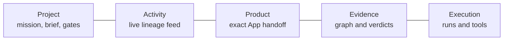
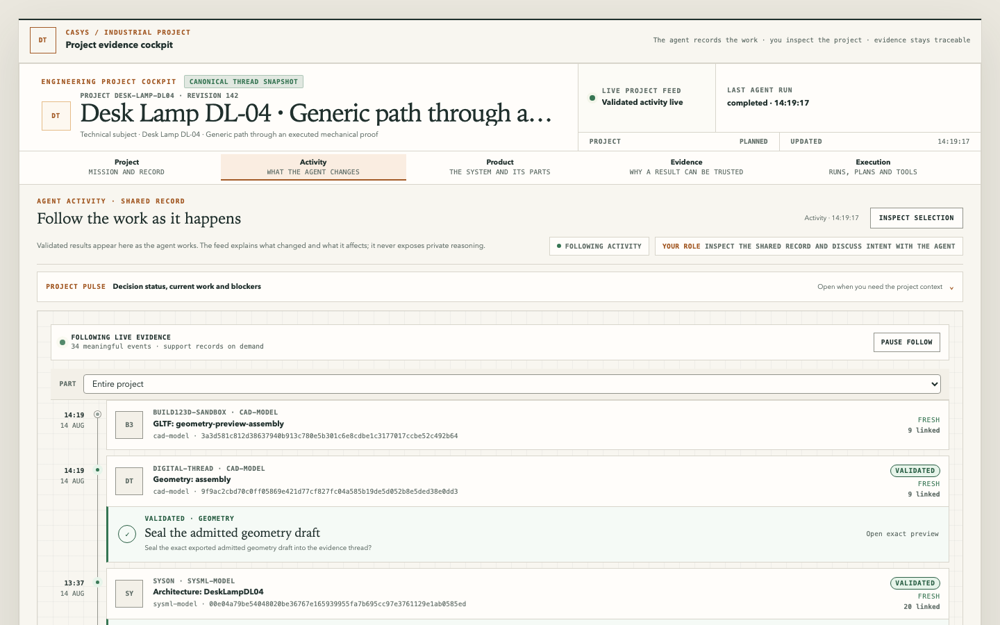
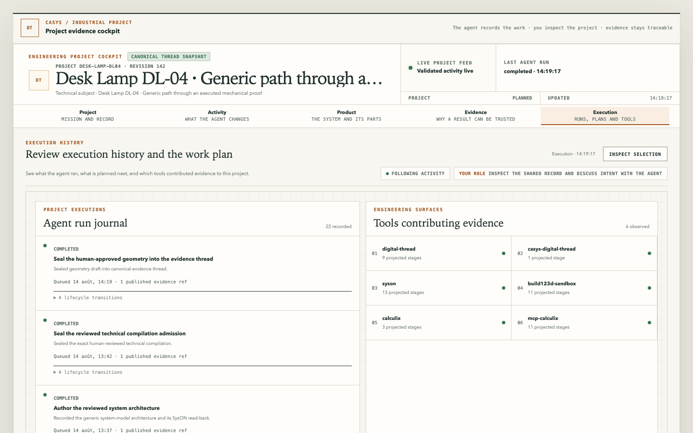

# How-to: preview the native digital-thread Workbench

Audience: both · Diátaxis: how-to · Kind: how-to

Use this guide to inspect the single-shell React + Vite cockpit against the distinct
truth surfaces it can render:

- the project objective, living brief, phases, work, decisions and blockers declared by
  immutable active `EngineeringProjectSnapshot` revisions under
  `state/local/engineering-projects/`;
- for a new V3 project, its living brief from first intent, then the immutable
  documentary r1 of its exact approved brief and reviewed path;
- the persisted technical evidence projected from exact canonical `ThreadSnapshot`
  revisions under `state/local/thread-snapshots/`.

The backend-for-frontend (BFF) chooses the applicable surface; it does not blend a
documentary record into an empty technical graph. Its `GET` and SSE paths are passive:
opening the page never starts an engineering tool. The cockpit has no command path;
human intent and consequential decisions stay in the paired agent conversation.

## Select the focused generic project

Install the UI dependencies once:

```bash
npm --prefix src/ui ci
```

The Workbench is **focus-only**. It opens exactly the project selected by the durable
cockpit focus, or the project ID explicitly passed by the operator. It never creates,
seeds, selects, or falls back to retired evidence, a checked-in baseline, the latest
thread head, or another project with the same subject.

`desk-lamp-dl04` is a useful focused project: sealed geometry, requirements, and proof
evidence. `desk-lamp-dl05` continues into sensitivity. A `verify.run-fea-static-proof@3`
success is only a captured, reread Thread revision under `state/local/` (gitignored). If
that revision is absent, the cockpit must not present historical MCP `@1`/`@2` as `@3`.
Activity promotes later demo-loop documents with literal labels: `measured DFM`,
`study-base evaluation`, `corrected source`. A missing card means the run was not
persisted, not that it passed.

## Start the Workbench BFF

```bash
deno task preview:thread
```

The task starts Vite with HMR at the human URL and the read-only Deno BFF behind it:

```text
http://127.0.0.1:5173/          Vite cockpit (default)
http://127.0.0.1:5175/          BFF API / SSE; `preview:cockpit` hashed-asset shell
```

No Console MCP server or provider MCP is required to read an already persisted project
and thread. `GET /api/project/capabilities` additionally observes the local Docker
daemon and the code-owned Microsandbox image cache through fixed read-only inspections;
the preview task grants those exact local runtime permissions but has no Docker mutation
path. A domain App window appears only when the composition has an exact
`ThreadViewerAppBinding` and its same-origin launch resolver has attested the exact
manifest and whole-view HTML MIME, byte count and fingerprints. The browser rechecks
those bytes and creates a confined Blob document rather than navigating the frame to the
launch route; otherwise the whiteboard truthfully emits no App. With no durable focus
and no explicit `--project-id`, the BFF reports that it is awaiting project context. It
does not write state to make the page appear populated. Subsequent project commands
create immutable numbered revisions under `state/local/engineering-projects/`; preview
reads those revisions without rewriting checked-in configuration or historical evidence.

A schema-3.0 project has its own identity and active revision directory from the first
intent. Before it has a declared root record, the BFF returns its planning surface even
if another thread for the same subject happens to exist locally.

To open an already-created V3 project, name its project ID alone:

```bash
deno task preview:thread --project-id=<project-id>
```

The BFF resolves the persisted project's subject (normally `project:<project-id>`) after
opening its active revision. `--subject=<subject-id>` remains an explicit operator
override. No-argument preview remains focus-only and never falls back to retired
evidence.

Refreshing the page performs one ordinary HTTP GET and opens one same-origin server-sent
event stream. Neither path mutates project state nor reruns assembly, build123d,
CalculiX, or Modelica. Provider MCP calls happen only in an explicit backend runner or
in a separately orchestrated agent workflow.

## Follow the agent-selected workspace

For the paired-project flow, start one same-origin workspace shell instead:

```bash
deno task preview:cockpit --port=5175
```

The agent creates or resumes a project with `project_start` / `project_snapshot`, then
uses `cockpit_focus_set` to point workspace `primary` at that durable project. It guides
questions, records sourced answers, proposes the brief, and requests exact human
confirmation in the paired conversation. Focus never changes because framing and later
engineering work share one project identity. `cockpit_focus_snapshot` supplies the
optimistic focus revision.

The browser has no selector and no command route: it only reads durable focus. The root
always remains the same project cockpit and the **Project** tab stays the entry point.
From project revision 1 onward it renders the living brief, then the current path and
engineering record without sending the person to another product page. A focus change
creates no project, answer, run, tool call, evidence, or approval. Before an agent
selects a target, workspace mode clearly says it is awaiting project context; it never
silently falls back to retired evidence.

## Inspect the truth boundary

```bash
curl -i http://127.0.0.1:5175/api/thread/workbench
```

For a focused technical-evidence surface, the response header contains:

```text
X-Casys-Data-Source: canonical-thread-snapshot
```

While a technical engineering run is waiting for canonical publication, the value is
`canonical-thread-snapshot+live-updates`. Other surfaces identify their own source; a
client should treat the header as a display/audit label, not as a request to substitute
another local snapshot.

The JSON document is one atomic browser read model:

```json
{
  "schemaVersion": "engineering-workbench/0.6",
  "surface": "evidence",
  "project": {
    "schemaVersion": "4.0",
    "project": { "id": "desk-lamp-dl04" },
    "phases": [],
    "workItems": [],
    "agentRuns": [],
    "decisions": [],
    "approvals": [],
    "blockers": []
  },
  "thread": {
    "schemaVersion": "thread-workbench/0.2",
    "source": "observed",
    "live": { "schemaVersion": "live-thread-overlay/1.0" }
  },
  "projectPath": {
    "phaseLanes": [
      { "phaseId": "architecture", "lane": "system-model" },
      { "phaseId": "canonical-geometry", "lane": "geometry" }
    ],
    "activities": [
      {
        "id": "activity:establish-product-architecture",
        "lane": "system-model",
        "rootRevisionId": "establish-product-architecture",
        "revisionIds": ["establish-product-architecture"]
      }
    ]
  },
  "alignment": {
    "status": "aligned",
    "projectThreadRevision": 5,
    "currentThreadRevision": 5
  },
  "caseActivityJoins": []
}
```

The abbreviated arrays above describe shape only; the real response contains the full
validated project and technical projection. `alignment.status` is:

- `aligned` when the current technical head is the exact revision referenced by the
  project;
- `thread-ahead` when a newer technical revision has a fully resolvable `previous` chain
  back to the exact project head, but project decisions still refer to that older input.
  The cockpit shows the descendant evidence and names the lag; it never promotes a
  parallel branch or pretends that existing decisions were made against the newer state.

A schema 4.0 project created from first intent returns `"surface": "planning"` until its
first documentary baseline exists. That variant contains the living brief, durable
project path, and `planning.technicalBaseline.status: "not-created"`; it has no `thread`
or `alignment` field and returns `X-Casys-Data-Source: engineering-project-plan`. The
BFF does not use the current subject head as a substitute for that missing baseline.

After `baseline.from-approved-brief@1` has completed, it instead returns
`"surface": "documentary"`. That surface contains one immutable record of the exact
human-approved brief and reviewed path, its snapshot/artifact identity, capture URI and
SHA-256 fingerprint. It deliberately has no technical `thread`, `alignment`, graph,
provider-specific viewer payload, observation, requirement, evaluation, violation, or
verdict. It answers “what approved project did we start from?”, not “what has
engineering proved?”

The standard technical `"surface": "evidence"` is used only once a later operation has
created and validated technical evidence. It also does not embed the separate
`ThreadComponentCatalog`, provider topology, or mesh-preview payload. The browser
receives literal generic graph records; exact whole-App sessions and their admitted
resources arrive through the separate viewer-session projection.
`architecture.seed-syson-model@2` first adds r2 with normalized identities for one
blank, read-back SysON project container, SysML document, and root package, bound to the
exact approved brief and documentary artifact. It makes no CAD, simulation, measurement,
requirement evaluation, or physical verdict appear by itself. From that basis, the
generic architecture, integer-requirements, and geometry-seal operations may publish
their own exact reviewed descendants. No surface receives an automatic schema conversion
or thread-head fallback.

Before serving planning, documentary, or evidence state, the BFF resolves every declared
project snapshot by exact ID and validates its entity references. A missing exact
snapshot fails closed; it is never replaced by the latest available document.

The live read path is:

```bash
curl -N http://127.0.0.1:5173/api/thread/workbench/events
```

It emits a complete `engineering-workbench/0.6` replacement as
`event: workbench-snapshot`. Event IDs include the relevant Project and Thread
revisions, live-activity version and, when source authoring is composed, the exact
ProjectSourceWorkspace head identity. A workspace-only put, detach or recross therefore
invalidates the read-only projection without requiring a browser reload. IDs remain
opaque to clients: use `Last-Event-ID` only for reconnection, not as a technical lineage
identifier.

A persisted project revision, a redacted public milestone for the initial documentary
run, a durable documentary record, or a canonical technical publication can each update
the cockpit. The browser never receives raw MCP tool output or a partial graph delta.
Reconnecting with `Last-Event-ID` replays no tool call.

On the **evidence** surface, the projection must show:

- source `observed`, not `fixture`;
- `projectPath.activities` grouped by the persisted `activityId` and
  `predecessorRevisionId`, not by operation keys or labels;
- `caseActivityJoins` from each typed Thread case to the Project activity that produced
  its authority artifact, when the producer run is unique;
- exact condensed Overview connectors through hidden documentary/evidence/result nodes,
  never an invented edge;
- exact producer and consumed SHA-256 values for every claimed CAD handoff;
- the canonical whole-machine STEP after an explicit build run is attached;
- provider branches only after their explicit runs are published;
- an unavailable verdict when no model-owned mechanical requirement is present; and
- evaluations only after their exact requirements, observations and evidence have been
  attached.

On the **documentary** surface, the page instead shows the durable starting record and a
plain-language boundary: technical proof is not recorded yet. It must not show an empty
graph as if it were a technical model, nor reuse another project's graph or evidence
records.

## Review the initial V3 sequence

For an idea/specification project, the human and agent have a deliberately small,
ordered interaction:

1. The agent guides questions and records sourced answers inside the same durable
   schema-3.0 project, then asks the person to confirm the exact proposed living brief
   in the paired conversation. This is planning, not an engineering result.
2. The agent publishes the reviewed path and queues the documentary
   `baseline.from-approved-brief@1` work item. It does not ask the person to enter CAD,
   solver, material, legal, or requirement values.
3. The agent executes that server-owned recording operation. The activity area can show
   its public queued/running/publishing milestones, but no provider payload or technical
   result because no provider is involved.
4. Once the immutable capture and root r1 are durable, the planning page becomes the
   documentary record. The reviewer can inspect the exact fingerprint.
5. Through `project_change_append`, the agent adds the next bounded work against exact
   r1, then queues `architecture.seed-syson-model@2`. The server uses its fixed SysON
   sequence to create a blank project container, document, and root package, then reads
   the root back. The caller provides no provider/tool selection, arguments, SysML text,
   or output.
6. The executor normalizes those identities, persists and reads back its capture and r2,
   then attaches that exact r2 reference to the project before it completes the run.
   Until that attachment, the Workbench keeps showing documentary r1 plus provisional
   live activity; it does not promote the persisted-but-unattached record to an evidence
   surface. Its durable write-ahead record means an uncertain SysON creation becomes a
   terminal failed run for operator inspection and human uncertain-writer
   reconciliation, never a blind retry. r2 is only an editable container identity, not a
   system architecture, requirements, CAD, simulation, measurement, or verdict.
7. Through a new bounded change and an exact human MRTR decision, the agent may queue
   `model.write-architecture@1`. The server renders the reviewed package/system/usage
   grammar, journals the SysON insertion, re-reads the typed structure, and attaches
   only the content-addressed verified descendant.
8. A later reviewed change may queue `model.write-requirements@1` against that exact
   architecture. It records and re-extracts the approved integer scalar constraints
   without inventing observations, evaluations, or a verdict.
9. Geometry remains a separate two-step decision. Capture and `compile.seal-admission@3`
   admit parameterized CAD; `project_admitted_geometry_export` creates the hash-attested
   draft; `design.write-geometry@1` seals those exact bytes. A preview-only draft is
   refused. Binary glTF exports are served and published as `.glb`, never as JSON
   `.gltf`.

These are explicit bounded work items, not an automatic pipeline.

If the technical seed stops before attachment, the project remains on its documentary r1
surface. The UI must not claim an r2 model or evidence merely because a provider write,
authorization, or live milestone exists.

## Review the focused project

Open **Project**. Its notification view is deliberately a light signal and a route into
the relevant dossier, not a form or command center. Its content is derived only from the
focused project's exact immutable revision; no other record can be substituted.
`required` is not a request for the person to invent material, support, load, or
criterion values: it means the agent still owes one concrete, evidence-bound
recommendation.

1. When a decision becomes **Needs your review**, follow its context to **Activity**.
   Inspect the upstream evidence and downstream impact if needed.
2. Return to the paired conversation. Ask for an explanation, state a correction, or
   answer the agent's exact decision prompt there.
3. For an approval or rejection, the agent calls `project_decision_approve` or
   `project_decision_reject`. The MCP host presents signed elicitation for the exact
   proposal fingerprint. In a conforming host, it waits for your explicit response
   before retrying the tool.
4. Once work is ready, the agent calls `project_agent_run_queue`. The server derives the
   run identity, summary, basis, and registered operation from durable state.
5. The agent calls `project_agent_run_execute` for that exact queued run. The cockpit
   receives progress and result projections through SSE; no page click launches a tool.

The cockpit therefore remains read-only even while the project changes. It receives no
generic MCP endpoint or provider credential. The agent may queue and execute only a
registered operation, cannot confirm its own proposal, and cannot supply a raw provider
name, arguments, result snapshot, or evidence payload.

The V3 executor resolves its operation, basis, bindings, capture, root snapshot, and
completion evidence from server-owned state; callers cannot submit a tool name, raw tool
arguments, result snapshot, or evidence payload. The generic route can record the
approved-brief documentary baseline, create the fixed brief-bound SysON container, then
execute the exact reviewed architecture, integer-requirements, and geometry-seal
contracts. The provider-free `model.seal-architecture-sysml@1` slice seals
agent-authored closed-subset SysML as a Thread **document** and does not appear as a
SysON insertion. In Activity, only the `architecture-sysml-seal-` document is primary;
generic `document` artifacts stay in lineage. Selecting it exposes only the generic
exact record and provenance. A domain presentation opens only when one whole App is
registered for that exact anchor; otherwise it remains unavailable. Digital Thread does
not reopen SysML source or render a native seal inspector. It is not the approved-brief
`surface: "documentary"` and is not Product Structure. These operations persist and read
back their closed captures and refuse an uncertain non-idempotent write instead of
retrying it blindly. Generic simulation, measurement, requirement evaluation,
manufacturing, and certification still need their own reviewed executors and evidence
contracts.

The page opens on **Project**, which answers what the focused project is trying to
achieve, what needs attention, and where to go next. The five product sections have
distinct jobs.









A first-time walkthrough of the same loop is
[Follow the engineering loop](../../how-to/verify-design/walk-through-an-engineering-project.md).
Agents that must not confuse write/seal/compile paths should read
[agent workspace](../../reference/agent/agent-workspace.md) before calling tools.

- **Project** — objective, lightweight notifications, derived phase gates, current work,
  next work, blockers, and routes into the relevant context;
- **Activity** — agent work plus the live lineage feed: the primary evidence and impact
  context for a review, never private chain-of-thought;
- **Product** — a read-only handoff to the exact whole Apps registered for this Thread
  basis; domain presentation opens spatially on the Project whiteboard;
- **Evidence** — full graph, causal impact, requirements, verdicts and named violations;
- **Execution** — agent-run journal, declared work items and engineering systems that
  contributed evidence.

In **Activity**:

- leave **Follow live** enabled so a newly persisted fact becomes active automatically;
- when a review notification arrives, trace the recommendation through its linked
  evidence and downstream impact, then answer in the paired conversation;
- read the active card's complete inline subgraph as upstream evidence → selected fact →
  downstream impact;
- pause following or select an older card only when revisiting history;
- select an edge to inspect its typed relation, rationale, and any hash attestation;
- inspect graph fields, exact record fields and recorded relations in the right drawer;
- open **Graph** for the complete subject graph and **Show all evidence** only when
  implementation artifacts and consumption proof nodes are needed;
- treat separate component frames as missing causal links, not layout errors.

Use **Product** as the explicit handoff when navigation starts from a physical component
instead of a thread event. It lists only exact whole-App descriptors already accepted
for the current project/Thread basis and returns to the Project whiteboard to open one.
It does not reconstruct a SysML tree, geometry canvas, solver surface or ERP table.

On the Project whiteboard, right-click the exact recorded anchor, or focus it and press
the Context Menu key / Shift+F10. When exactly one whole App is registered the gesture
opens it directly, with no intermediate menu. Zero matches stays `Unavailable`; more
than one stays `Ambiguous`, and the browser chooses neither. It never infers an App from
a provider label or artifact kind. The floating window remains sandboxed with scripts
only. An App that needs exact binary bytes requests the registered `sha256:<digest>`
over its one-shot document-scoped MessagePort; it never raw-fetches a provider or
chooses a URI.

The local snapshot records its exact provider revisions and capture timestamps. Treat it
as integration evidence unless those provider revisions are released and reproduced in
the target environment.

## Know what this slice proves

It proves durable project and canonical-thread validation, exact project-to-evidence
references, explicit provider-to-subject references and literal recorded graph
identities, persisted Modelica observations and ERPNext BOM detail, passive read/SSE
paths, signed revision-bound human elicitation in the agent channel, the bounded V3
documentary r1 flow, and the fixed r1-to-r2 SysON container seed with read-back
normalized identities and no blind retry. It also proves one coherent native shell with
shared selection and exact contextual App windows that do not add provider authority to
Digital Thread.

It does **not** prove:

- a new solve at preview time;
- a SysML model, CAD geometry, simulation, measurement, requirement verdict, or
  compliance conclusion merely because a V3 documentary record exists;
- a system architecture, requirement, CAD model, simulation, measurement, or verdict
  merely because the V3 SysON container seed has recorded r2;
- a whole-machine mechanical or compliance verdict;
- a production-material, fabrication-release, certification, or automatic correction
  claim;
- a browser command or provider-execution API. Explicit agent tools and registered
  backend runners own provider MCP calls and canonical publication.

## Compare the preview paths

| Command                     | Address                  | Purpose                                                        |
| --------------------------- | ------------------------ | -------------------------------------------------------------- |
| `deno task preview:thread`  | `http://127.0.0.1:5173/` | Vite HMR cockpit; `/api` proxies to :5175                      |
| `deno task preview:cockpit` | `http://127.0.0.1:5175/` | Same BFF; serves built HTML + hashed JS/CSS from `dist/thread` |

Provider MCP Apps own rich domain results. Digital Thread hosts only their exact
registered whole view as a sandboxed whiteboard window; it does not copy their renderer
or Apps handshake into the native bundle. `preview:browser` refuses.

## Stop the preview

Press `Ctrl-C` in the BFF terminal. Stopping it does not affect Docker, engineering
services, Console state, active project revisions, or persisted Modelica runs.
