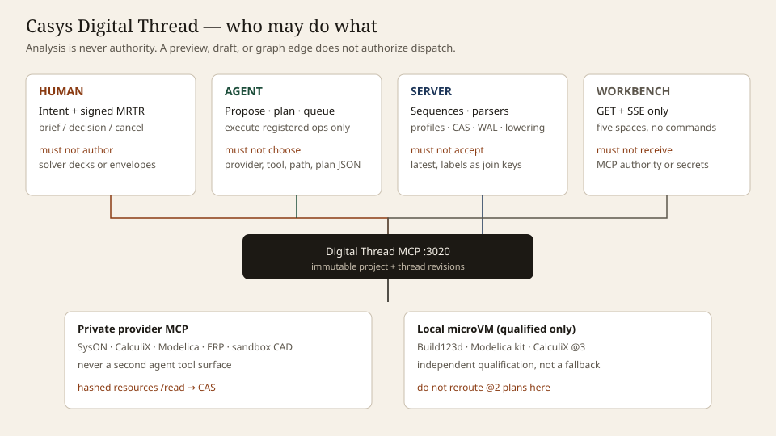
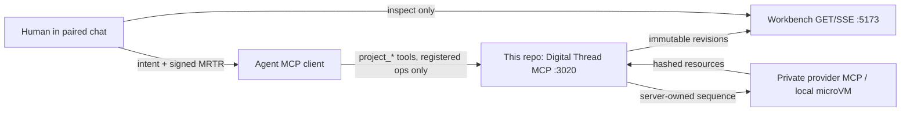
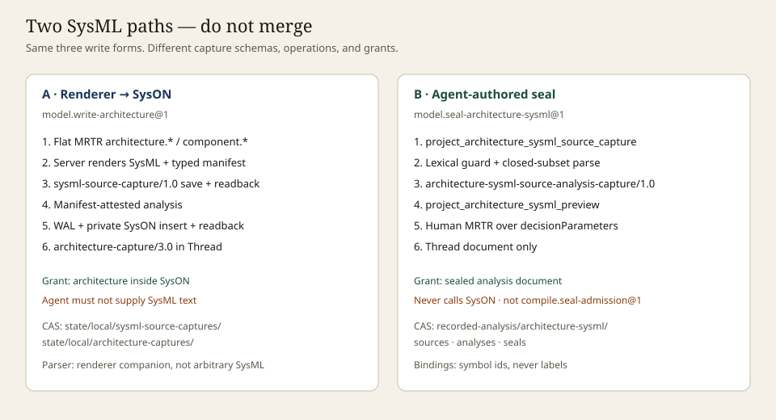
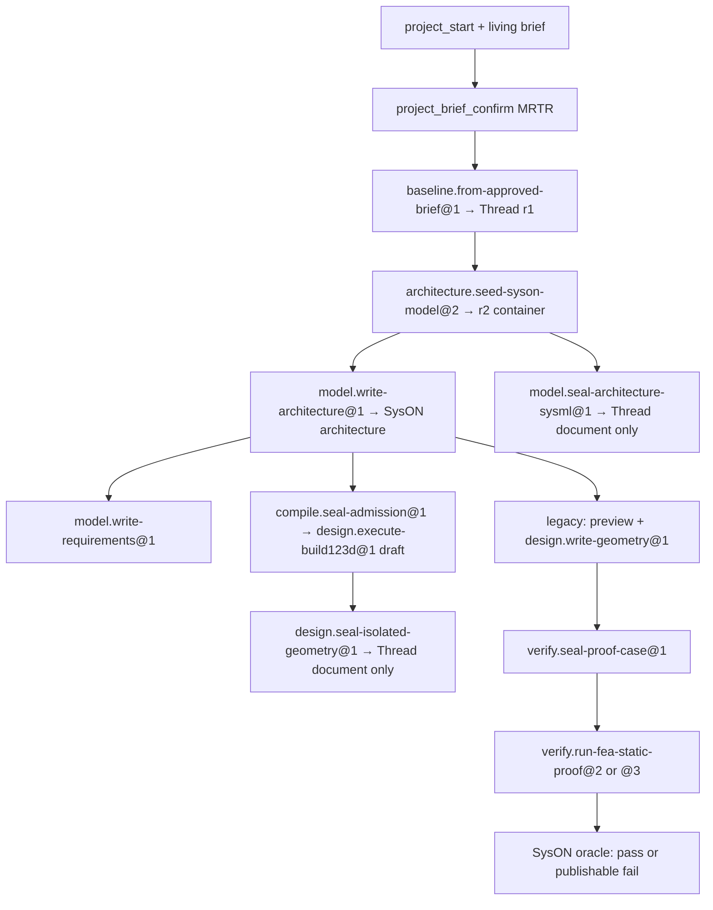

# Reference: agent workspace

This page is the working contract for coding agents and project-control agents in this
repository. It is not a product tutorial. For the first human loop, see
[Follow the engineering loop](../tutorials/first-engineering-loop.md). For file
locations and ports, see [the workspace map](workspace-map.md).

The page is written so an agent can parse it: tables over prose, exact IDs, explicit
grants, and lookalike pairs that must not be merged.

## 1. What this repo owns

This repo is the atelier: Console MCP, project-control MCP, native Workbench, registered
operations, CAS, WAL, and immutable project/thread state.

Engineering providers live in other repos and run from published images. Do not clone
`mcp-syson`, `mcp-build123d`, `mcp-calculix`, or `mcp-modelica` here to “fix” an
operation. Change a provider only in its own repo.





## 2. Authority

Three actors. None may take another’s role.

| Actor     | May                                                                                               | May not                                                                                                                                   |
| --------- | ------------------------------------------------------------------------------------------------- | ----------------------------------------------------------------------------------------------------------------------------------------- |
| Agent     | Author reviewed artefacts, select a **registered** operation, queue, execute the exact queued run | Choose provider name, tool, endpoint, path, envelope, recovery graph, or plan JSON; self-approve MRTR; invent units or omitted unresolved |
| Human     | Confirm exact brief/decision/cancel via MCP elicitation                                           | Be asked to invent solver decks, SysON AQL, or provider arguments                                                                         |
| Server    | Own sequences, profiles, parsers, lowering, CAS, WAL                                              | Treat `latest`, labels, or UI selection as join keys                                                                                      |
| Workbench | Project persisted revisions                                                                       | Mutate project state or call providers                                                                                                    |

Analysis is never authority. A `source-analysis/1.0` bundle, a preview, a
`ready-for-review` draft, or a Graphology edge does not authorize dispatch.

A queued run is not a published result. Only a captured, reread Thread revision is true.

## 3. Lookalike traps

These pairs look related and are **not** substitutes.



| This                                                      | Is                                                           | Is not                                                                  |
| --------------------------------------------------------- | ------------------------------------------------------------ | ----------------------------------------------------------------------- |
| `model.write-architecture@1`                              | Server-rendered SysML inserted into SysON                    | An agent-authored SysML parser path                                     |
| `model.seal-architecture-sysml@1`                         | Provider-free Thread-document seal of closed-subset analysis | SysON insertion, `@2` architecture write, or `compile.seal-admission@1` |
| `sysml-source-capture/1.0`                                | Renderer envelope for the SysON write                        | Agent-authored UTF-8 authority                                          |
| `architecture-sysml-source-analysis-capture/1.0`          | Agent-authored closed-subset CAS                             | A renderer manifest                                                     |
| `project_geometry_preview` + `design.write-geometry@1`    | Historical MCP sandbox preview then hash seal                | Isolated compiler execution                                             |
| `compile.seal-admission@1` + `design.execute-build123d@1` | Provider-free admission then local microVM draft execution   | Canonical geometry promotion                                            |
| `design.seal-isolated-geometry@1`                         | Provider-free Thread-document seal of isolated execution     | Canonical STEP, cad-model, `write-geometry`, or FEA geometry            |
| `verify.run-fea-static-proof@1`                           | Historical generic MCP FEA                                   | The current recorded or isolated successors                             |
| `verify.run-fea-static-proof@2`                           | Recorded CalculiX MCP plan (`resolved-operation-plan/2.0`)   | The local microVM `@3` executor                                         |
| `verify.run-fea-static-proof@3`                           | Isolated local CalculiX + separate SysON oracle              | A reinterpretation of `@2` plans                                        |
| `simulate.run-modelica-scenario@2`                        | Recorded provider Modelica                                   | `simulate.run-qualified-modelica-kit@1` (one local kit)                 |
| `planning-only` operation                                 | May be queued as work; executor may be absent or draft-only  | A trusted Thread writer                                                 |
| CM-01 / `state/fixtures/retired/`                         | Historical golden record                                     | A live project, fallback, or provider admission                         |
| `desk-lamp-dl04`                                          | Generic qualification candidate                              | Live `@2` proof until that distinct run is persisted and reread         |

## 4. Surfaces an agent actually calls

The agent talks **only** to this repo’s MCP server (`http://127.0.0.1:3020/mcp`).
Provider MCP ports are private backend dependencies.

### Project lifecycle

| Tool                                                               | Authority        | Effect                                                         |
| ------------------------------------------------------------------ | ---------------- | -------------------------------------------------------------- |
| `project_start`                                                    | Agent mutation   | Create schema-3.0 project from plain-language intent           |
| `project_snapshot`                                                 | Read             | Current project, decisions, runs, receipts                     |
| `project_question_propose`                                         | Agent mutation   | One framing question                                           |
| `project_answer_record`                                            | Agent or human   | Sourced answer or explicit unknown                             |
| `project_brief_propose`                                            | Agent mutation   | Living brief revision; not canonical                           |
| `project_brief_confirm`                                            | Human MRTR       | Promote exact brief revision                                   |
| `project_plan_publish`                                             | Agent mutation   | Unexecuted plan from approved brief only                       |
| `project_change_append`                                            | Agent mutation   | Append-only next change; never rewrite history                 |
| `project_decision_propose`                                         | Agent mutation   | Typed proposal                                                 |
| `project_decision_approve` / `project_decision_reject`             | Human MRTR       | Exact proposal only                                            |
| `project_agent_run_queue`                                          | Bounded mutation | Server derives run id, basis, summary                          |
| `project_agent_run_execute`                                        | Server dispatch  | One queued registered operation                                |
| `project_agent_run_cancel`                                         | Human MRTR       | Still-queued run only                                          |
| `project_agent_run_plan_get`                                       | Read             | Inspect sealed `resolved-operation-plan/2.0`; does not execute |
| `project_work_item_reconcile_successor`                            | Recovery         | Close an orphan after a real successor                         |
| `project_work_item_supersede_unstarted`                            | Recovery         | Replace unstarted work                                         |
| `cockpit_focus_set` / `cockpit_focus_snapshot`                     | UI routing       | Point the cockpit at one durable project                       |
| `project_review_intent_list` / `project_review_intent_acknowledge` | Review outbox    | Receipt of a Workbench intent; never an approval               |

### Architecture SysML frontend (agent-authored)

| Tool                                        | Writes               | Grant                                                         |
| ------------------------------------------- | -------------------- | ------------------------------------------------------------- |
| `project_architecture_sysml_source_capture` | Draft CAS only       | Opaque reference. No project, Thread, MRTR, or SysON          |
| `project_architecture_sysml_preview`        | None (or reopen CAS) | Diagnostics + optional `decisionParameters`. Not Thread state |

How-to: [Author architecture SysML](../how-to/author-architecture-sysml.md).

### Brief compilation (approved brief → proposal grammar)

| Tool                                | Writes | Grant                                                      |
| ----------------------------------- | ------ | ---------------------------------------------------------- |
| `project_brief_architecture_review` | None   | `decisionParameters` for `model.write-architecture@1` only |
| `project_brief_requirements_review` | None   | `decisionParameters` for `model.write-requirements@1` only |

The server reopens the exact human-approved canonical brief itself; no brief bytes,
parameter keys, structural admissibility or unit admissibility come from the caller.
Every emitted parameter carries the brief item it was traced to.

Provenance rules differ by what is being stated. A requirement threshold is normative,
so it may only cite a gate item (`success-criterion` or `verification-activity`). An
architecture element is not a gate and only has to be sourced — but it may never cite an
`exclusion` or an `open-question`, which declare what is out of scope or still
undecided. The requirements container component only has to be sourced.

An absent, non-normative, non-committing or unsourced item, a duplicate slug, or an
envelope the grammar refuses — unsupported unit, non-integer threshold, unknown parent,
cycle — yields `unresolved` with diagnostics and **no** parameters, never a partially
compiled proposal.

One code-owned normalisation exists: a threshold declared in `MPa` is rescaled to `Pa`
and the provenance entry names the transformation (see [Oracle units](oracle-units.md)).
SysON cannot round-trip `MPa` (probe
`deno task probe:requirement-units --unit=MPa --type=PressureValue`, 2026-08-14,
`type_mismatch`), and refusing outright would only move the same conversion into the
agent's head where nothing records it.

Its limit is contractual: the brief carries free-text statements, so the server never
reads the prose and never asserts that a declared value restates its statement. It
records where the value came from; the signing human confirms what it says.

How-to: [Compile brief parameters](../how-to/compile-brief-parameters.md).

### Technical compilation / isolated CAD

| Tool                                        | Writes                   | Grant                                                            |
| ------------------------------------------- | ------------------------ | ---------------------------------------------------------------- |
| `project_technical_source_capture`          | Draft CAS                | Opaque source+analysis reference                                 |
| `project_technical_compilation_preview`     | Review draft CAS         | `decisionParameters` for `compile.seal-admission@1` only         |
| `project_admitted_geometry_export`          | Geometry **draft**       | Parameters for `design.write-geometry@1`. Not isolated execution |
| `project_build123d_execution_review`        | None                     | Parameters for `design.execute-build123d@1`. No capability       |
| `project_isolated_geometry_seal_review`     | None                     | Parameters for `design.seal-isolated-geometry@1`. No STEP bytes  |
| `project_modelica_qualified_kit_run_review` | None                     | Parameters for the one local Modelica kit                        |
| `project_geometry_preview`                  | Geometry draft (sandbox) | Historical MCP path; registered only if sandbox is composed      |

## 5. Registered operations

Source of truth:
[`src/orchestration/operations/registry.ts`](../../src/orchestration/operations/registry.ts).
Unknown ids/versions are indistinguishable from absent.

| Operation                                           | Execution                 | Provider                     | What a success is                                    | What it is not                       |
| --------------------------------------------------- | ------------------------- | ---------------------------- | ---------------------------------------------------- | ------------------------------------ |
| `baseline.from-approved-brief@1`                    | trusted                   | none                         | Documentary Thread r1                                | A model or proof                     |
| `architecture.seed-syson-model@2`                   | trusted                   | SysON                        | Blank container identity (r2)                        | Architecture or requirements         |
| `model.write-architecture@1`                        | trusted                   | SysON                        | `architecture-capture/3.0` after renderer + readback | Agent-supplied SysML                 |
| `model.capture-part-definitions@1`                  | trusted                   | SysON                        | Read-only PartDefinition structure bundle            | Quantity, CAD, or a new design fact  |
| `model.seal-architecture-sysml@1`                   | trusted                   | none                         | Thread document of closed-subset analysis            | SysON write or compilation admission |
| `model.write-requirements@1`                        | trusted                   | SysON                        | Integer scalar requirements                          | A verdict                            |
| `compile.seal-admission@1`                          | trusted                   | none                         | Admission capture                                    | Execution authority                  |
| `design.execute-build123d@1`                        | trusted                   | local microVM                | Documentary capture + noncanonical draft             | Canonical STEP in Thread             |
| `design.seal-isolated-geometry@1`                   | trusted                   | none                         | Thread document of isolated execution identities     | STEP artifact, cad-model, or FEA     |
| `design.preview-geometry@1`                         | planning-only             | sandbox MCP                  | Draft bundle                                         | Thread write                         |
| `design.write-geometry@1`                           | trusted                   | none (seal)                  | Canonical geometry capture                           | Re-execution of CAD                  |
| `verify.seal-proof-case@1`                          | trusted                   | none                         | Sealed proof-case artifact                           | A solve                              |
| `verify.run-fea-static-proof@1`                     | trusted                   | CalculiX MCP + SysON         | Historical verdict                                   | `@2` or `@3`                         |
| `verify.run-fea-static-proof@2`                     | trusted                   | recorded CalculiX + SysON    | Current MCP qualification path                       | Isolated `@3`                        |
| `verify.run-fea-static-proof@3`                     | trusted                   | local microVM + SysON oracle | Isolated successor                                   | Reroute of `@2` plans                |
| `simulate.seal-simulation-case@1`                   | trusted                   | none                         | V1 case artifact                                     | A run                                |
| `simulate.run-modelica-scenario@1`                  | trusted                   | Modelica MCP                 | Observations only                                    | A verdict                            |
| `simulate.seal-simulation-case@2`                   | trusted                   | Modelica resources           | Planless V2 seal                                     | A simulation                         |
| `simulate.run-modelica-scenario@2`                  | trusted                   | recorded Modelica            | Observations via ROP 2.0                             | Local kit `@1`                       |
| `simulate.run-qualified-modelica-kit@1`             | trusted                   | local microVM                | One fixed linear-ramp kit                            | Arbitrary Modelica                   |
| `design.apply-vector-correction@1`                  | planning-only             | none                         | Correction proposal                                  | A provider run                       |
| `record.reconcile-uncertain-writer@1`               | trusted, **human origin** | none                         | Release or inspect an uncertain write                | Agent inspection of a provider       |
| `record.archive-lineage@1`                          | trusted                   | none                         | Append-only archive change                           | SysML deletion                       |
| `architecture.author-inspection-drone@3`            | trusted                   | SysON                        | Product-specific drone r3                            | A generic architecture op            |
| `model.capture-inspection-drone-part-definitions@1` | trusted                   | SysON                        | Product-specific r4                                  | Generic product structure            |

Queueing sequence for any trusted consequential op:

```text
project_change_append (work item + required decision together)
  -> project_decision_propose
  -> project_decision_approve   # human MRTR
  -> project_agent_run_queue    # server stamps basis
  -> project_agent_run_execute  # no payload
```

`architecture.seed-syson-model@2` **must** arrive via `project_change_append`, never the
initial `project_plan_publish`. See
[sequence a SysON seed](../how-to/sequence-seed-work-item.md).

## 6. Implemented language frontends

Same outer contract (`source-analysis/1.0`). Different parsers. Unresolved is
first-class and never omitted.

| Profile / analyzer                                                   | Language               | Qualifies                                                                                                                                                                                                                                    | Leaves unresolved                                                                                |
| -------------------------------------------------------------------- | ---------------------- | -------------------------------------------------------------------------------------------------------------------------------------------------------------------------------------------------------------------------------------------- | ------------------------------------------------------------------------------------------------ |
| `sysml-architecture-closed-subset-v1`                                | SysML v2 closed subset | `package { part def }`, empty-or-block `part def`, `part usage : Type;`                                                                                                                                                                      | Comments, strings, numbers, attributes, `requirement`, anything else                             |
| Rendered architecture companion                                      | Server-rendered SysML  | Manifest-attested PartUsage→target only                                                                                                                                                                                                      | Arbitrary SysML                                                                                  |
| `build123d-closed-subset-v1` (`build123d-qualified-lezer` **1.2.0**) | Python / build123d     | `Box`, `Cylinder`, `Cone`, `Sphere`, `Torus`, `Ellipsoid`, `Wedge`, `Pos`, `Rot`, `Compound`; `+`/`-` solids; `scale(solid, scalar)`; `fillet(solid.edges(), radius=scalar)`; `chamfer(solid.edges(), length)`; numeric params; one `result` | D4-allowed but unproven syntax; do not open general MemberExpression, `.faces()`, or `filter_by` |
| Python CAD frontend (legacy preview)                                 | Python                 | Conservative bindings into `result`                                                                                                                                                                                                          | Calls, imports, branches, functions…                                                             |
| Project-brief frontend                                               | Canonical brief JSON   | Item ids + explicit V2 gate dependencies                                                                                                                                                                                                     | Prose inference, V1 gates                                                                        |

Bindings published by the architecture SysML analyzer are **symbol ids**, never labels.
Labels are display data.

Qualified Build123d 1.2.0 extends the earlier Box/Cylinder/Pos/Compound subset with
later positional 3-D solids, `Rot`, solid `+`/`-`, algebraic `scale(solid, scalar)`,
`fillet(solid.edges(), radius=scalar)`, and `chamfer(solid.edges(), length)`. Previously
qualified bundles stay bit-identical; the public analysis identity does not change for
existing sources.

Next AST lock: do not treat `fillet(solid, r)` or `chamfer(solid, l)` positional-solid
forms as reviewed. `extrude` still needs a 2-D sketch subset plus `amount=` kwargs.

## 7. Golden path (generic V3)



A documentary r1 or a SysON container r2 is **not** an architecture, a CAD model, a
measurement, or a verdict.

## 8. Where to put code

Hexagonal. Dependencies point inward. Adapters never become domain authority.

| Layer       | Path                                                  | May import       | Must not                                     |
| ----------- | ----------------------------------------------------- | ---------------- | -------------------------------------------- |
| Domain      | `src/domain/`                                         | domain + kernel  | `Deno.*`, `fetch`, MCP, UI, Graphology       |
| Application | `src/application/`                                    | domain + ports   | Concrete adapters                            |
| Adapters    | `src/adapters/`                                       | ports + domain   | Become the public contract                   |
| Operations  | `src/orchestration/operations/`                       | domain contracts | Provider tool names in the planning registry |
| Tools       | `src/tools/`                                          | inbound ports    | Own CAS/provider clients                     |
| Composition | `server.ts`                                           | everything       | Leak handles into domain                     |
| UI          | `src/ui/src/`                                         | `src/contracts/` | Command authority, MCP credentials           |
| Tests       | `*_test.ts` colocated; UI tests at `src/ui/*_test.ts` | `@std/assert`    | Preact render tests                          |

New non-test module → add it to the `deno.json` `check` file list. The omission is
silent.

UI change under `src/ui/src/` → rebuild the affected bundle (`build` / `build:thread`)
and commit `src/ui/dist/**`.

## 9. Persistence roots that matter

| Path                                                                        | Content                                                    |
| --------------------------------------------------------------------------- | ---------------------------------------------------------- |
| `state/local/engineering-projects/`                                         | Immutable project revisions                                |
| `state/local/thread-snapshots/`                                             | Canonical Thread revisions                                 |
| `state/local/recorded-analysis/`                                            | Compilation, isolated CAD, recorded Modelica/CalculiX, ROP |
| `state/local/recorded-analysis/architecture-sysml/{sources,analyses,seals}` | Agent-authored SysML CAS                                   |
| `state/local/sysml-source-captures/`                                        | Renderer `sysml-source-capture/1.0`                        |
| `state/local/architecture-captures/`                                        | `architecture-capture/3.0` (SysON write)                   |
| `state/fixtures/retired/`                                                   | CM-01 only. Never replay                                   |

Do not treat a directory listing or “latest file” as authority. Reopen by content
address.

## 10. Verification

Targeted while implementing. Full suites at integration milestones.

```bash
# one colocated test — copy permissions, do not pass a path to deno task test
deno test --allow-read --allow-write --allow-net=127.0.0.1,localhost --allow-env \
  src/domain/engineering/architecture-sysml-parse_test.ts

deno task check          # type-check listed non-test modules
deno task lint
deno task fmt            # --check only; write with: deno fmt <path>
deno task test
deno task check:ui
deno task verify:thread:presentation
deno task verify:evidence
```

Never report a green suite obtained with `--no-check`.

## 11. Labels that stay literal

`succeeded` = a simulation completed. `passed` / `failed` = a comparison is attached.
`unavailable`, `unresolved`, `error`, `provisional`, `documentary`, `unverified`,
`demo`, `TRACE GAP`, `UNLINKED` are evidence states. Do not strip them for readability.
