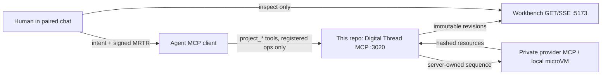
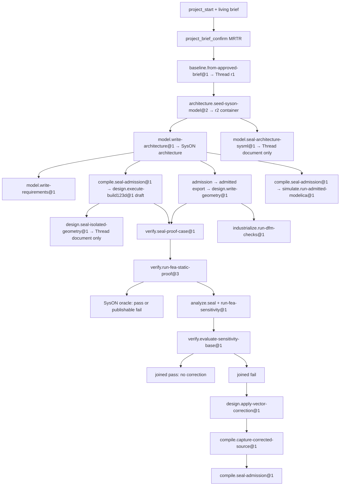

# Reference: agent workspace

Audience: agent · Diátaxis: reference · Kind: contract

This page is the working contract for coding agents and project-control agents in this
repository. It is not a product tutorial. For the first human loop, see
[Follow the engineering loop](../../tutorials/first-engineering-loop.md). For file
locations and ports, see [the workspace map](../runtime/workspace-map.md) and
[the source map](../runtime/workspace-source-map.md). Lookalikes:
[lookalike traps](lookalike-traps.md).

The page is written so an agent can parse it: tables over prose, exact IDs, explicit
grants, and lookalike pairs that must not be merged.

| § | Open                                              |
| - | ------------------------------------------------- |
| 3 | [Lookalike traps](lookalike-traps.md) (extracted) |
| 4 | Surfaces an agent actually calls                  |
| 5 | Registered operations                             |
| 6 | Implemented language frontends                    |
| 7 | Golden path                                       |
| 8 | Where to put code                                 |

## 1. What this repo owns

This repo is the atelier: Console MCP, project-control MCP, native Workbench, registered
operations, CAS, WAL, and immutable project/thread state.

Engineering providers live in other repos and run from published images. Do not clone
`mcp-syson`, `mcp-build123d`, or `mcp-calculix` here to “fix” an operation. Fleet
`mcp-calculix` is a sensitivity capability, not the provenance of product static `@3`
(local microVM). The retired port 3016 `mcp-modelica` sidecar is not a product path.
Change a provider only in its own repo.




## 2. Authority

Three actors. None may take another’s role.

| Actor     | May                                                                                               | May not                                                                                                                                   |
| --------- | ------------------------------------------------------------------------------------------------- | ----------------------------------------------------------------------------------------------------------------------------------------- |
| Agent     | Author reviewed artefacts, select a **registered** operation, queue, execute the exact queued run | Choose provider name, tool, endpoint, path, envelope, recovery graph, or plan JSON; self-approve MRTR; invent units or omitted unresolved |
| Human     | Confirm exact brief/decision/cancel via MCP elicitation                                           | Be asked to invent solver decks, SysON AQL, or provider arguments                                                                         |
| Server    | Own sequences, profiles, parsers, lowering, CAS, WAL                                              | Treat `latest`, labels, or UI selection as join keys                                                                                      |
| Workbench | Project persisted revisions                                                                       | Mutate project state or call providers                                                                                                    |

Analysis is never authority. A `source-analysis/1.0` bundle, a preview, a
`ready-for-review` draft, or a Graphology edge does not authorize dispatch.

A queued run is not a published result. Only a captured, reread Thread revision is true.

## 3. Lookalike traps

Full tables: [lookalike traps](lookalike-traps.md). Keep this heading so older
`#3-lookalike-traps` links still land.

| Family                       | Open                                                                   |
| ---------------------------- | ---------------------------------------------------------------------- |
| SysML                        | [lookalike traps § SysML](lookalike-traps.md#sysml)                    |
| CAD and compile              | [lookalike traps § CAD](lookalike-traps.md#cad-and-compile)            |
| Modelica                     | [lookalike traps § Modelica](lookalike-traps.md#modelica)              |
| FEA, sensitivity, correction | [lookalike traps § FEA](lookalike-traps.md#fea-sensitivity-correction) |
| DFM and print                | [lookalike traps § DFM](lookalike-traps.md#dfm-and-print)              |
| Other                        | [lookalike traps § Other](lookalike-traps.md#other)                    |

## 4. Surfaces an agent actually calls

The agent talks **only** to this repo’s MCP server (`http://127.0.0.1:3020/mcp`).
Provider MCP ports are private backend dependencies. Loopback CLI:
`deno task mcp:call --name=<tool> --args='{}'`. It fills omitted `issuedAt` only when
the arguments already include `commandId`. `cockpit_focus_set` may omit
`expectedRevision`. `deno task preview:thread` follows cockpit focus unless
`--project-id=` pins a vehicle.

### Control-plane fleet reads

Ops tools on the same `:3020/mcp` server. They are not a human page. The retired Console
MCP App (`ui://casys-digital-thread/console`) is not registered; `preview:browser`
refuses. Product inspection is `preview:thread` / `preview:cockpit`.

| Tool                    | Authority         | Effect                                                                     |
| ----------------------- | ----------------- | -------------------------------------------------------------------------- |
| `console_snapshot`      | Read              | Desired versus observed MCP fleet and indexed run summaries                |
| `console_server_detail` | Read              | One server: desired state, observation, image/trust, drift                 |
| `console_run_list`      | Read              | Indexed engineering-run summaries                                          |
| `console_run_detail`    | Read              | Evidence, observations, comparison verdict, provenance                     |
| `console_refresh`       | App-only leftover | Probe refresh; not listed to ordinary MCP clients; no shipped App calls it |

### Project lifecycle

| Tool                                                               | Authority        | Effect                                                                                                                                                                                                                                                                               |
| ------------------------------------------------------------------ | ---------------- | ------------------------------------------------------------------------------------------------------------------------------------------------------------------------------------------------------------------------------------------------------------------------------------ |
| `project_start`                                                    | Agent mutation   | Create schema-3.0 project from plain-language intent                                                                                                                                                                                                                                 |
| `project_snapshot`                                                 | Read             | Current project, decisions, runs, receipts. Completed FEA/DFM/sensitivity-base runs carry a read-time `join` from Thread `evaluations[]`. Sensitivity, DFM, printability, print-estimate and FEA runs carry `observations` from Thread `observations[]`. Neither field is persisted. |
| `project_question_propose`                                         | Agent mutation   | One framing question                                                                                                                                                                                                                                                                 |
| `project_answer_record`                                            | Agent or human   | Sourced answer or explicit unknown                                                                                                                                                                                                                                                   |
| `project_brief_propose`                                            | Agent mutation   | Living brief revision; not canonical. Result carries `nextTool`, `briefSnapshotId`, `briefRevision`, `inputFingerprint` for confirm                                                                                                                                                  |
| `project_brief_confirm`                                            | Human MRTR       | Promote that exact pending brief                                                                                                                                                                                                                                                     |
| `project_plan_publish`                                             | Agent mutation   | Unexecuted plan from approved brief only                                                                                                                                                                                                                                             |
| `project_change_append`                                            | Agent mutation   | Append-only next change; never rewrite history. Seed `dependsOnWorkItemIds` must name the unique baseline work item.                                                                                                                                                                 |
| `project_decision_propose`                                         | Agent mutation   | Typed proposal                                                                                                                                                                                                                                                                       |
| `project_decision_approve` / `project_decision_reject`             | Human MRTR       | Exact proposal only                                                                                                                                                                                                                                                                  |
| `project_agent_run_queue`                                          | Bounded mutation | Server derives run id, basis, summary                                                                                                                                                                                                                                                |
| `project_agent_run_execute`                                        | Server dispatch  | One queued registered operation. Same read-time `join` / `observations` hoist as `project_snapshot`.                                                                                                                                                                                 |
| `project_agent_run_cancel`                                         | Human MRTR       | Still-queued run only                                                                                                                                                                                                                                                                |
| `project_agent_run_plan_get`                                       | Read             | Inspect sealed `resolved-operation-plan/2.0`; does not execute                                                                                                                                                                                                                       |
| `cockpit_focus_set` / `cockpit_focus_snapshot`                     | UI routing       | Point the cockpit at one durable project                                                                                                                                                                                                                                             |

Successor closeout of a leftover ready work item is **not** an MCP tool. Inspect or
apply with `deno task recover:work-item-successor`. Default is inspect. `--apply` writes
through the same command service. See
[sequence a SysON seed](../../how-to/behave/sequence-seed-work-item.md#rule-4--closing-an-orphan-with-direct-reconciliation).

### Architecture SysML frontend (agent-authored)

| Tool                                        | Writes               | Grant                                                         |
| ------------------------------------------- | -------------------- | ------------------------------------------------------------- |
| `project_architecture_sysml_source_capture` | Draft CAS only       | Opaque reference. No project, Thread, MRTR, or SysON          |
| `project_architecture_sysml_preview`        | None (or reopen CAS) | Diagnostics + optional `decisionParameters`. Not Thread state |

How-to: [Author architecture SysML](../../how-to/compile/author-architecture-sysml.md).

### LED-driver human source

| Tool                                 | Writes         | Grant                                                                                                                                      |
| ------------------------------------ | -------------- | ------------------------------------------------------------------------------------------------------------------------------------------ |
| `project_led_driver_source_capture`  | Draft CAS only | `led-driver-source-capture-review/1.0`. Pass `result.reference` only. No project, Thread, D1, provider, tool, or ngspice                    |
| `project_led_driver_source_review`   | None           | Reopen one opaque `led-driver-source-capture/1.0` locator. Unknowns stay `unresolved`. Grants none. Never pass `sourceText` or the review envelope |

### Brief compilation (approved brief → proposal grammar)

| Tool                                | Writes | Grant                                                                                                                                              |
| ----------------------------------- | ------ | -------------------------------------------------------------------------------------------------------------------------------------------------- |
| `project_brief_architecture_review` | None   | `decisionParameters` for `model.write-architecture@1` only. Zero components is a single-part system; optional `attributes` compile AttributeUsage. |
| `project_brief_requirements_review` | None   | `decisionParameters` for `model.write-requirements@1` only                                                                                         |

The server reopens the exact human-approved canonical brief itself; no brief bytes,
parameter keys, structural admissibility or unit admissibility come from the caller.
Every emitted parameter carries the brief item it was traced to.

Provenance rules differ by what is being stated. A requirement threshold is normative,
so it may only cite a gate item (`success-criterion` or `verification-activity`). An
architecture element is not a gate and only has to be sourced — but it may never cite an
`exclusion` or an `open-question`, which declare what is out of scope or still
undecided. The requirements container component only has to be sourced.

An absent, non-normative, non-committing or unsourced item, a duplicate slug, or an
envelope the grammar refuses — unsupported unit, non-integer threshold, unknown parent,
cycle — yields `unresolved` with diagnostics and **no** parameters, never a partially
compiled proposal.

One code-owned normalisation exists: a threshold declared in `MPa` is rescaled to `Pa`
and the provenance entry names the transformation (see [Oracle units](../providers/oracle-units.md)).
SysON cannot round-trip `MPa` (probe
`deno task probe:requirement-units --unit=MPa --type=PressureValue`, 2026-08-14,
`type_mismatch`), and refusing outright would only move the same conversion into the
agent's head where nothing records it.

Its limit is contractual: the brief carries free-text statements, so the server never
reads the prose and never asserts that a declared value restates its statement. It
records where the value came from; the signing human confirms what it says.

How-to: [Compile brief parameters](../../how-to/compile/compile-brief-parameters.md).

### FEA compilation (catalog / sealed proof → proposal)

| Tool                              | Writes | Grant                                                                                   |
| --------------------------------- | ------ | --------------------------------------------------------------------------------------- |
| `project_fea_proof_seal_review`   | None   | `decisionParameters` plus `next.append` / `next.propose` for `verify.seal-proof-case@1` |
| `project_fea_isolated_run_review` | None   | Isolated `@3` bindings plus guarded hops. `geometry` = canonical part STEP              |

The caller names `projectId`, with optional `caseId`, `basis`, and false-by-default
`sensitivityCatalogOptIn` on the proof-seal review. Omitted `caseId` / `proofArtifactId`
/ `basis` are resolved server-side (unique catalog case, unique sealed document, unique
current Thread tip). That tip is not `latest`. There is no `fea.run.*` grammar: numbers
stay in the sealed proof; the isolated `@3` run admits thread-entity bindings. A true
sensitivity opt-in is accepted only when the exact admission source matches the proof
CAD definition and its unique causal lever and `result` bindings join the proof target.
The same MRTR signs the offer digest and admission artifact. The executor reopens both
and publishes a separate catalog-offer document derived from the proof and admission; it
does not invent the still-uncompiled sensitivity step.

The result names `selected` (case, digest, STEP, proof document, work item, decision).
Only an exact current project head also receives `next.append.arguments` /
`next.propose.arguments`, which are complete argument envelopes for those tools. A
historical basis, conflicting project identity, unreadable geometry/STEP source, or
requested sensitivity offer without an exact causal join returns `unavailable` or
`unresolved` with an exact diagnostic and no `next`. Never relabel that as `resolved`.
The isolated-run proposal restates the compiled identities so the agent does not invent
solver numbers.

An unknown catalog id, a project or subject mismatch, an absent or ambiguous STEP, or a
cad-model offered as `geometry` yields `unresolved` with diagnostics and **no**
parameters or bindings. `rejectedLookalikes` names the assembly cad-model (and any
sibling cad-models in one diagnostic) so they are not copied into a later `@3` proposal.

How-to: [Compile FEA parameters](../../how-to/compile/compile-fea-parameters.md).

### Sensitivity compilation (catalog / admission → proposal)

| Tool                                    | Writes | Grant                                                                                           |
| --------------------------------------- | ------ | ----------------------------------------------------------------------------------------------- |
| `project_sensitivity_study_seal_review` | None   | `decisionParameters` plus `next.append` / `next.propose` for `analyze.seal-sensitivity-study@1` |

The caller may name only `projectId`. Omitted `caseId` / `basis` are resolved
server-side (unique catalog template for that `project.id`, or the unique signed
catalog-offer when the catalog does not uniquely select — absent or ambiguous; unique
current Thread tip). That tip is not `latest`. `cadSource` is the
`compile.seal-admission@1` admission already signed on that offer, or the unique
readable admission whose source has exactly one module-level numeric binding equal to
the template `target.semanticKey`. A cad-model, STEP, `design.write-geometry@1`, or
`design.seal-isolated-geometry@1` is a lookalike and never `cadSource`. Only an exact
current project head also receives `next.append.arguments` / `next.propose.arguments`. A
historical basis, catalog-absent project without a signed offer, unbound semanticKey, or
unreadable admission returns `unavailable` or `unresolved` with an exact diagnostic and
no `next`. Never relabel that as `resolved`. The caller never invents mesh, loads,
boxes, hashes, or `arm_thickness`.

How-to:
[Compile sensitivity-study parameters](../../how-to/compile/compile-sensitivity-parameters.md).

`desk-lamp-dl06` has no reviewed catalog JSON. A unique signed catalog-offer on the
current tip is enough for this compiler; the seal reopens that same offer. The review /
seal / run tools stay.

### Technical compilation / isolated execution

| Tool                                         | Writes             | Grant                                                                                                                            |
| -------------------------------------------- | ------------------ | -------------------------------------------------------------------------------------------------------------------------------- |
| `project_technical_source_capture`           | Draft CAS          | Review: `parser` + `levers` + opaque `reference`. Pass `result.reference` only                                                   |
| `project_technical_compilation_preview`      | Review draft CAS   | `projectId` + `result.reference`. Server tip/profile/unique SysML join. `decisionParameters` for `compile.seal-admission@1` only |
| `project_admitted_geometry_export`           | Geometry **draft** | Parameters for `design.write-geometry@1`. Not isolated execution                                                                 |
| `project_build123d_execution_review`         | None               | Parameters for `design.execute-build123d@1`. No capability                                                                       |
| `project_isolated_geometry_seal_review`      | None               | Parameters for `design.seal-isolated-geometry@1`. No STEP bytes                                                                  |
| `project_vector_correction_review`           | None               | Parameters for `design.apply-vector-correction@1`. No Thread write                                                               |
| `project_sensitivity_base_evaluation_review` | None               | Ready only if study metrics join Thread requirements exactly                                                                     |
| `project_corrected_admission_review`         | None               | Parameters for `compile.seal-admission@1` from a corrected source                                                                |
| `project_evaluation_closeout_review`         | None               | `projectId` only. Server reopens one current static FEA `@3` branch and derives closed human L5 accept/reject parameters; no solver/SysON/CAD/correction grant |
| `project_modelica_qualified_kit_run_review`  | None               | Parameters for the one local Modelica kit                                                                                        |
| `project_admitted_modelica_run_review`       | None               | `projectId` only. Server selects current tip + unique fresh sealed Modelica admission. No `modelicaText`                         |
| `project_geometry_preview`                   | None               | Not registered. Not a product entry                                                                                              |

`project_technical_compilation_preview` takes `projectId` and `result.reference` only.
Omitted `basis` is the unique current Thread tip, not `latest`. Profile selection and
SysML bindings are unique server joins: one catalog profile per source role,
`represents` only if there is one `result` and one PartDefinition, `parameterizes` only
if one AttributeUsage shares the parameter name. Declare that AttributeUsage on
`model.write-architecture@1` with `attribute.<slug>.name` and `attribute.<slug>.parent`.
Ambiguous or missing SysML stays `binding.missing`. The preview result hoists those join
facts as `gaps` (symbol name, relation, candidate count, recovery). The compilation
document keeps its closed diagnostic record. The server does not invent a causal lever
or an AttributeUsage.

The current Build123d compilation profile is 2.0. Capture and compile keep three facts
apart:

- `parser.status` is the closed-subset parser. It is not admission.
- `levers.status` is a reachable named numeric literal. A constructor photo is
  `unresolved` (`source.no-named-numeric-lever`).
- Unique `parameterizes` is compile. A reachable literal without that bind is
  `binding.missing`, not a missing lever.

A source is reviewable only when a reachable named literal is bound through
`parameterizes` to the unique `result` artifact. Embedded profile-1 documents remain
readable for historical replay; this does not let a new profile-2 admission use the old
predicate. `project_admitted_geometry_export → design.write-geometry@1` is the only
canonical STEP path. A draft without the admission stamp, or without a named numeric
lever, is `admission_required`. A system-only admitted export authors
`geometry-manifest/2.0` with authoritative STEP when the sealed admission has a unique
`represents` PartDefinition and the architecture has zero PartUsages. Empty components and
occurrences are valid in that case; the system PartDefinition is the FEA target. For a
multi-part architecture, the server instead derives the exact represented definition and
authors one `geometry-part-manifest/1.0` target draft. It contains no assembly, components,
occurrences, placements, or `partDefinitions` array, and remains a draft rather than a Thread
write.

## 5. Registered operations

Source of truth:
[`src/orchestration/operations/registry.ts`](../../../src/orchestration/operations/registry.ts).
Unknown ids/versions are indistinguishable from absent.

| Operation                                           | Execution                 | Provider                     | What a success is                                                                                                       | What it is not                                                       |
| --------------------------------------------------- | ------------------------- | ---------------------------- | ----------------------------------------------------------------------------------------------------------------------- | -------------------------------------------------------------------- |
| `baseline.from-approved-brief@1`                    | trusted                   | none                         | Documentary Thread r1                                                                                                   | A model or proof                                                     |
| `architecture.seed-syson-model@2`                   | trusted                   | SysON                        | Blank container identity (r2); closed seed MRTR                                                                         | Architecture or requirements                                         |
| `model.write-architecture@1`                        | trusted                   | SysON                        | `architecture-capture/3.0` after renderer + readback. Optional `attribute.<slug>.(name\|parent)` becomes AttributeUsage | Agent-supplied SysML                                                 |
| `model.capture-part-definitions@1`                  | trusted                   | SysON                        | Sealed architecture subgraph bundle                                                                                     | Quantity, CAD, or a new design fact                                  |
| `model.seal-architecture-sysml@1`                   | trusted                   | none                         | Thread document of closed-subset analysis                                                                               | SysON write or compilation admission                                 |
| `model.write-requirements@1`                        | trusted                   | SysON                        | Integer scalar requirements (SysON 0.5.1)                                                                               | A verdict                                                            |
| `compile.seal-admission@1`                          | trusted                   | none                         | Admission capture                                                                                                       | Execution authority                                                  |
| `compile.capture-corrected-source@1`                | trusted                   | none                         | Substituted source document + preview reference                                                                         | Admission, CAD execution, or rewriting apply-vector-correction       |
| `design.execute-build123d@1`                        | trusted                   | local microVM                | Documentary capture + noncanonical draft                                                                                | Canonical STEP in Thread                                             |
| `design.seal-isolated-geometry@1`                   | trusted                   | none                         | Thread document of isolated execution identities                                                                        | STEP artifact, cad-model, or FEA                                     |
| `design.write-geometry@1`                           | trusted                   | none (seal)                  | Canonical geometry capture                                                                                              | Re-execution of CAD                                                  |
| `verify.seal-proof-case@1`                          | trusted                   | none                         | Sealed proof-case; optional signed catalog-offer artifact                                                               | A solve or complete sensitivity case                                 |
| `verify.run-fea-static-proof@3`                     | trusted                   | local microVM + SysON oracle | Isolated CalculiX verdict                                                                                               | Historical MCP FEA, agent `.inp`, or a cad-model as `geometry`       |
| `decide.accept-cross-domain-impact@1`               | trusted, **human origin** | none                         | Apply the exact X07/X08 proposed gate-claim statuses onto existing work-item claims after signed MRTR                   | Work-item invention/invalidation, a rerun, or a provider/solver call |
| `decide.accept-evaluation-closeout@1`               | trusted                   | none                         | Agent-dispatched documentary successor after exact human MRTR; accepts only all literal L4 `pass` criteria              | An implicit L5, solver/SysON call, or CAD/correction grant           |
| `decide.reject-evaluation-closeout@1`               | trusted                   | none                         | Agent-dispatched documentary successor after exact human MRTR; records only `none` or `mechanical-review-required`      | A correction/CAD/FEA/provider action grant                           |
| `simulate.run-qualified-modelica-kit@1`             | trusted                   | local microVM                | Separate fixed LinearThermalRamp qualified-kit V1 smoke                                                                | Admitted closed-subset `.mo`                                         |
| `simulate.run-admitted-modelica@1`                  | trusted                   | local microVM                | Documentary run of sealed `compile.seal-admission@1` Modelica bytes                                                     | The pinned kit or caller `modelicaText`                              |
| `analyze.seal-sensitivity-study@1`                  | trusted                   | none                         | Sealed 2.0 study-case document                                                                                          | A solve or a verdict                                                 |
| `analyze.run-fea-sensitivity@1`                     | trusted                   | isolated CAD + fleet `mcp-calculix` | Dimensioned observations + study capture                                                                          | A verdict or product static `@3`                                     |
| `verify.evaluate-sensitivity-base@1`                | trusted                   | SysON                        | Evaluations that cite `sensitivity-base-<metric>-<digest>`                                                              | A solve, a proof `@3`, or a metric alias                             |
| `model.write-sensitivity-edges@1`                   | trusted                   | SysON                        | Server-rendered derivative PartDef                                                                                      | Architecture write or agent SysML                                    |
| `industrialize.seal-printability-case@1`            | trusted                   | none                         | Sealed printability-check-case/1.0 document                                                                             | A DFM dispatch or verdict                                            |
| `industrialize.observe-printability@1`              | trusted                   | mcp-dfm                      | Unit-carrying FDM observations                                                                                          | A verdict or evaluation                                              |
| `industrialize.seal-dfm-case@1`                     | trusted                   | none                         | Sealed dfm-check-case/1.0 document                                                                                      | A DFM dispatch or the estimate path                                  |
| `industrialize.run-dfm-checks@1`                    | trusted                   | mcp-dfm                      | Measured observations + fail-closed evaluations                                                                         | `observe-printability` or a quote                                    |
| `industrialize.seal-print-estimate-case@1`          | trusted                   | none                         | Sealed print-estimate-case/1.0 document                                                                                 | A slice or a price                                                   |
| `industrialize.observe-print-estimate@1`            | trusted                   | mcp-prusaslicer              | Time and material observations                                                                                          | A cost quote or verdict                                              |
| `design.apply-vector-correction@1`                  | trusted                   | none                         | Thread document of a bounded correction proposal (`grants: none`)                                                       | CAD, SysON, provider, admission, or a join of proof-run observations |
| `record.reconcile-uncertain-writer@1`               | trusted, **human origin** | none                         | Release or inspect an uncertain write                                                                                   | Agent inspection of a provider                                       |
| `record.archive-lineage@1`                          | trusted                   | none                         | Append-only archive change                                                                                              | SysML deletion                                                       |
| `architecture.author-inspection-drone@3`            | trusted                   | SysON                        | Product-specific drone r3                                                                                               | A generic architecture op                                            |
| `model.capture-inspection-drone-part-definitions@1` | trusted                   | SysON                        | Product-specific r4                                                                                                     | Generic product structure                                            |

### Measured DFM (`industrialize.seal-dfm-case@1` + `industrialize.run-dfm-checks@1`)

This pair is the measured authority. It does not replace
`industrialize.observe-printability@1`, which stays the documentary estimate path
(observations only, no evaluation).

Live mcp-dfm 0.1.0 tools take `step_path` + `expected_step_sha256`, not STL.
`build_volume_mm` is an object `{x, y, z}`. The sealed case must declare the Z-min
bed-contact filter; the executor applies that signed filter and traces it. It must not
invent a min-Z heuristic. A check fail is publishable with a named violation.

Queueing sequence for any trusted consequential op:

```text
project_change_append (work item + required decision together)
  -> project_decision_propose
  -> project_decision_approve   # human MRTR
  -> project_agent_run_queue    # server stamps basis
  -> project_agent_run_execute  # no payload
```

`architecture.seed-syson-model@2` **must** arrive via `project_change_append`, never the
initial `project_plan_publish`. See
[sequence a SysON seed](../../how-to/behave/sequence-seed-work-item.md).

### Live-run lessons (`desk-lamp-dl05`)

Observed on the real agent path. Contract facts, not style.

| Lesson                                                           | Exact rule                                                                                                                                                                                                                                     | When it fails                                                                                                                                                                                                                                                                                                                                                                                 |
| ---------------------------------------------------------------- | ---------------------------------------------------------------------------------------------------------------------------------------------------------------------------------------------------------------------------------------------- | --------------------------------------------------------------------------------------------------------------------------------------------------------------------------------------------------------------------------------------------------------------------------------------------------------------------------------------------------------------------------------------------- |
| Every SysON write names its predecessor work item                | Seed `dependsOnWorkItemIds` **must** include the unique `baseline.from-approved-brief@1` work item. Later SysON writes should name their predecessor the same way for sequencing.                                                              | Seed: `project_change_append` refuses with `invalid_input` (`Operation architecture.seed-syson-model@2 must depend on baseline.from-approved-brief@1 work item <id>`). The executor still refuses historical work items accepted before that guard. Architecture and requirements resolve the predecessor from the Thread (seed capture / architecture tip), not from `dependsOnWorkItemIds`. |
| Requirement thresholds are integers                              | `requirement.<slug>.threshold` is a safe integer. SysON 0.5.1 cannot round-trip a decimal literal through `syson_constraint_extract` (`LiteralRational`).                                                                                      | Grammar rejects at `project_decision_propose`. Message: threshold must be a safe integer because SysON 0.5.1 cannot round-trip decimal literals through `syson_constraint_extract`.                                                                                                                                                                                                           |
| Seed MRTR is closed                                              | Allowed keys: `seed.schemaVersion`, `seed.scope`, `seed.operation`, `model.name`. `model.name` is pinned to the server-owned role `system model`. `fingerprintSysonModelSeedProposal` is the envelope digest, not the MRTR `inputFingerprint`. | Grammar rejects a free-form key or any other `model.name` at `project_decision_propose`.                                                                                                                                                                                                                                                                                                      |
| Study metric ids must Object.is-equal Thread requirement metrics | `analyze.run-fea-sensitivity@1` publishes `sensitivity-base-<metric>-<digest>`. `verify.evaluate-sensitivity-base@1` joins only when `metric` is the Thread requirement metric.                                                                | Historical dl05 r16: study `assembly_max_*` vs requirements `maxDisplacement` / `maxVonMises` → `UNLINKED`. A later isolated reseal on that atelier joined. Do not invent a mapping. Do not replay r16. New project: [run the behave loop from zero](../../how-to/behave/run-the-behave-loop-from-zero.md).                                                                                             |
| Proof-run evaluations do not authorize a correction              | `design.apply-vector-correction@1` accepts only a fail that cites `sensitivity-base-<metric>-<digest>`.                                                                                                                                        | A proof-run `@3` `pass` on `calculix-observation-*` is a different authority. A joined study-base `pass` also does not apply a correction.                                                                                                                                                                                                                                                    |

Limit of the seed grammar: `assertProposalMatchesOperationGrammar` is project-agnostic.
It cannot pin `model.name` to `projectId` or `project.project.name`. The executor does
**not** consume the proposal: it names the SysON document
`${project.project.name} system model` and the SysON project
`${project.project.name} · system model seed · ${run.id}`. The hypothesis « nom =
projectId » is false. The signed `model.name` is therefore the role token, not the
provider display name.

## 6. Implemented language frontends

Same outer contract (`source-analysis/1.0`). Different parsers. Unresolved is
first-class and never omitted.

**Direction — closed-language compilation.** Every frontend targets a _closed_ language
(finite, pinned by version) and the goal is _complete_ coverage of that language,
derived from its introspected inventory — never hand-enumerated idiom by idiom, and
never an "attested but not understood" mode as a destination. For build123d 0.11.1 the
ground truth is the 473-name inventory in `config/build123d-api/inventory-0.11.1.json`
(regenerated by `scripts/probes/capture-build123d-api-inventory.ts`); constructs whose
result depends on engine-internal ordering are compiled too and carry a determinism
_class_ in the evidence instead of being excluded. Why and how:
[closed-language compilation](../../explanations/product/closed-language-compilation.md).

| Profile / analyzer                                                     | Language               | Boundary | Domain contract |
| ---------------------------------------------------------------------- | ---------------------- | -------- | --------------- |
| `sysml-architecture-closed-subset-v1`                                  | SysML v2 closed subset | `package`, `part def`, `part usage`; other constructs stay unresolved | This page |
| Rendered architecture companion                                        | Server-rendered SysML  | Manifest-attested PartUsage→target only | This page |
| `build123d-closed-subset-v1` (`build123d-qualified-lezer` **1.6.0**)   | Python / Build123d     | Finite geometry algebra, numeric parameters, one solid `result` | [CAD closed subset](../domains/cad/build123d-closed-subset-v1.md) |
| `modelica-closed-subset-v2` (`modelica-qualified-mo-subset` **2.0.0**) | Modelica               | Bounded generic scalar models with exact experiment annotation; no MSL packages | [Modelica language](../domains/modelica/language.md) |
| Python CAD frontend (legacy preview)                                   | Python                 | Conservative bindings into `result` | Historical only |
| Project-brief frontend                                                 | Canonical brief JSON   | Item ids + explicit V2 gate dependencies | This page |

Bindings published by the architecture SysML analyzer are **symbol ids**, never labels.
Labels are display data.

Exact accepted constructs, exclusions and extension rules live with their bounded
contexts under [engineering domains](../domains/README.md). Inventories under
`config/*-api/` remain documentary ground truth until a domain compiler consumes them.

## 7. Golden path (generic V3)



Three judgement branches hang off that same canonical STEP. Exact ops above; do not
invent a fourth join.

| Branch                                           | Played on dl05?    | Independent verdict               | Shared cause                                          |
| ------------------------------------------------ | ------------------ | --------------------------------- | ----------------------------------------------------- |
| Behave (CalculiX / Modelica / study-base)        | Yes                | A `@3` `pass` is not a DFM `pass` | Same STEP; a later CAD write retires the old proof    |
| Make (measured DFM; printability is documentary) | No                 | A DFM `fail` is not a `z*` grant  | Same STEP only. Isolated geometry is not a DFM target |
| Buy (BOM / ERP / cost)                           | No registered seal | —                                 | Same part identities when a binding exists            |

A documentary r1 or a SysON container r2 is **not** an architecture, a CAD model, a
measurement, or a verdict.

## 8. Where to put code

Hexagonal. Dependencies point inward. Adapters never become domain authority.

| Layer        | Path                                                  | May import                                 | Must not                                     |
| ------------ | ----------------------------------------------------- | ------------------------------------------ | -------------------------------------------- |
| Domain       | `src/domain/`                                         | domain + kernel                            | `Deno.*`, `fetch`, MCP, UI, Graphology       |
| Application  | `src/application/`                                    | domain + ports + owned read models         | Concrete adapters or presentation            |
| Presentation | `src/presentation/`                                   | presentation + domain types (`type-only`)  | Use cases, adapters, tools, UI               |
| Adapters     | `src/adapters/`                                       | ports + domain + read models               | Become the public contract                   |
| Operations   | `src/orchestration/operations/`                       | domain contracts                           | Provider tool names in the planning registry |
| Tools        | `src/tools/`                                          | inbound ports + application read models    | Own CAS/provider clients or presentation     |
| Composition  | `server.ts`                                           | everything                                 | Leak handles into domain                     |
| UI           | `src/ui/src/`                                         | presentation + application read models     | Command authority, MCP credentials           |
| Tests        | `*_test.ts` colocated; UI tests at `src/ui/*_test.ts` | `@std/assert`                              | React/DOM render tests                       |

Second axis: **authority context**, not pipeline verb. Layers stay at
`src/{domain,application,presentation,adapters}/` so the import gate remains
prefix-true. Compile
kernel is `src/domain/compile/` (isolation, admission, source, ROP, brief) — not
`domain/analysis/`. A new Modelica, CAD, FEA or compile module does **not** land in a
retired dump (`domain/analysis/`, `adapters/captures/`, `adapters/executors/`). Shared
adapters go to `src/adapters/shared/`, never `src/infrastructure/`. File census:
[workspace source map](../runtime/workspace-source-map.md).

| Context         | Domain root                      | Do not merge                                                                                         |
| --------------- | -------------------------------- | ---------------------------------------------------------------------------------------------------- |
| `modelica`      | `src/domain/modelica/`           | `admitted/` ≠ `qualified-kit/`; recorded island and sidecar observer are retired                     |
| `cad`           | `src/domain/cad/`                | `source/` ≠ `isolated/` ≠ `canonical/` ≠ `sealed-isolated/`                                          |
| `fea`           | `src/domain/fea/`                | `seal-case/` ≠ `isolated-v3/`                                                                        |
| `compile`       | `src/domain/compile/`            | Isolation ≠ admission ≠ source ≠ ROP ≠ brief; CAD **and** Modelica                                   |
| `project`       | `src/domain/project/`            | Ledger and brief; not Thread bytes                                                                   |
| `thread`        | `src/domain/thread/`             | Canonical snapshot; not a project command                                                            |
| `kernel`        | `src/domain/kernel/`             | Shared primitives only                                                                               |
| `sensitivity`   | `src/domain/sensitivity/`        | `study/` ≠ `edges/` ≠ `base-evaluation/` ≠ `vector-correction/` ≠ `correction-source/` ≠ `live-fea/` |
| `control-plane` | `src/application/control-plane/` | Fleet ops service + `console_*` tools. No domain kernel. Not a cockpit page                          |

The same split lives under
`src/adapters/{modelica,cad,fea,compile,architecture,inspection-drone,sensitivity,make,control-plane,shared}/`
and
`src/application/{ports,use-cases}/{modelica,cad,fea,compile,architecture,sensitivity}/`.
Folder = authority; lookalikes stay in sibling directories. Control-plane adapters are
fleet-manifest + run fixtures. Cross-authority adapters (MCP HTTP, project/thread
stores, microsandbox backend, byte/CAS, generic WAL helpers, executor-run-helpers,
docker-observer, thread-write-basis-guard) live in `src/adapters/shared/`.
Context-specific WAL stays next to its executor.

`deno task check` globs `src/adapters/**/*.ts`. Named `check:*` tasks still need their
path lists updated when a cited file moves.

UI change under `src/ui/src/` → rebuild the product bundle locally
(`npm --prefix src/ui run build:thread`). `src/ui/dist/thread` is generated and
gitignored; do not commit it. Surfaces that serve it build first. There is no Console
MCP App bundle; `preview:browser` refuses.

## 9. Persistence roots that matter

| Path                                                                        | Content                                                    |
| --------------------------------------------------------------------------- | ---------------------------------------------------------- |
| `state/local/engineering-projects/`                                         | Immutable project revisions                                |
| `state/local/thread-snapshots/`                                             | Canonical Thread revisions                                 |
| `state/local/recorded-analysis/`                                            | Compilation, isolated CAD/Modelica, isolated CalculiX, ROP |
| `state/local/recorded-analysis/architecture-sysml/{sources,analyses,seals}` | Agent-authored SysML CAS                                   |
| `state/local/sysml-source-captures/`                                        | Renderer `sysml-source-capture/1.0`                        |
| `state/local/architecture-captures/`                                        | `architecture-capture/3.0` (SysON write)                   |
| `state/local/dfm-case-captures/`                                            | Sealed `dfm-case-capture/1.0` documents                    |
| `state/local/dfm-check-captures/`                                           | Measured `dfm-check-capture/1.0` (evaluations included)    |
| `state/local/dfm-check-attempts/`                                           | WAL for `industrialize.run-dfm-checks@1`                   |
| `state/local/sensitivity-base-evaluation-captures/`                         | SysON join of study-base observations                      |
| `state/local/corrected-source-captures/`                                    | `compile.capture-corrected-source@1` documents             |
| `state/fixtures/retired/`                                                   | CM-01 only. Never replay                                   |

Do not treat a directory listing or “latest file” as authority. Reopen by content
address.

## 10. Verification

Targeted while implementing. Full suites at integration milestones.

```bash
# one colocated test — copy permissions, do not pass a path to deno task test
deno test --allow-read --allow-write --allow-net=127.0.0.1,localhost --allow-env \
  src/domain/architecture/agent-seal/architecture-sysml-parse_test.ts

deno task check          # type-check Deno globs; Vite UI is check:ui
deno task lint
deno task fmt            # --check only; write with: deno fmt <path>
deno task test
deno task check:ui
deno task verify:thread:presentation
deno task verify:evidence
```

Never report a green suite obtained with `--no-check`.

## 11. Labels that stay literal

`succeeded` = a simulation completed. `passed` / `failed` = a comparison is attached.
`unavailable`, `unresolved`, `error`, `provisional`, `documentary`, `unverified`,
`demo`, `TRACE GAP`, `UNLINKED` are evidence states. Do not strip them for readability.
