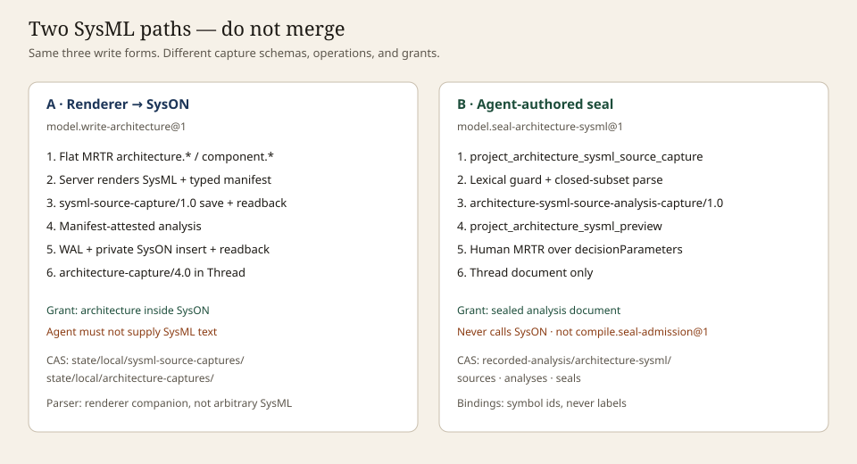

# Reference: SysML paths

Audience: both · Diátaxis: reference · Kind: contract

Two authorities. They are not substitutes. Language tokens and resource ingress:
[language](language.md). Implemented surface and exclusions: [coverage](coverage.md).
Lookalike table: [lookalike traps](../../agent/lookalike-traps.md).



| Facet          | Server renderer                                                                                                                            | Agent-authored closed subset                                                                                                                                               |
| -------------- | ------------------------------------------------------------------------------------------------------------------------------------------ | -------------------------------------------------------------------------------------------------------------------------------------------------------------------------- |
| Entry          | Human-signed flat MRTR: `architecture.package`, `system.name`, `component.<slug>.(name\|usage\|parent)`, `attribute.<slug>.(name\|parent)` | `.sysml` UTF-8 via `project_resource_capture` → full `resourceRef` → `project_architecture_sysml_source_capture` → `project_architecture_sysml_preview` (`sourceRef` only) |
| Bytes          | Server renders SysML; the agent supplies none                                                                                              | Exact reopened UTF-8; public tools take no `sourceText`                                                                                                                    |
| Envelope       | `sysml-source-capture/1.0`                                                                                                                 | `architecture-sysml-source-analysis-capture/1.0`                                                                                                                           |
| Operation      | `model.write-architecture@1`                                                                                                               | `model.seal-architecture-sysml@1`                                                                                                                                          |
| SysON          | `syson_element_insert_sysml` then reread                                                                                                   | Never called                                                                                                                                                               |
| Thread         | `architecture-capture/4.0` plus `sysml-model` artifact                                                                                     | Documentary Thread **document** plus `architecture-sysml-seal-capture/1.0`                                                                                                 |
| Success is not | Agent-authored SysML, compilation admission, a verdict                                                                                     | SysON write, `compile.seal-admission@3`, renderer envelope, Product Structure                                                                                              |

```text
human MRTR (flat architecture.* / component.* / attribute.*)
  → model.write-architecture@1
  → server render + SysON insert + reread
  → architecture-capture/4.0
```

```text
project_resource_capture
  → project_architecture_sysml_source_capture (full resourceRef)
  → project_architecture_sysml_preview (sourceRef)
  → human MRTR
  → model.seal-architecture-sysml@1
  → Thread document only
```

How-to for the second path:
[author architecture SysML](../../../how-to/compile/author-architecture-sysml.md).

## Distinct identities

These three identities stay distinct:

| Identity             | Schema / URI namespace                                                                                                | What it names                                                         |
| -------------------- | --------------------------------------------------------------------------------------------------------------------- | --------------------------------------------------------------------- |
| Raw resource digest  | `agent-resource-capture/1.0` · `casys://agent-resource-capture/sha256/<digest>`                                       | Exact uploaded bytes                                                  |
| Architecture capture | `architecture-sysml-source-analysis-capture/1.0` · `architecture-sysml-source` + `architecture-sysml-source-analysis` | Closed-subset source bytes plus analysis under the registered profile |
| Thread seal          | `architecture-sysml-seal-capture/1.0` · `casys://architecture-sysml-seal-capture/sha256/<digest>`                     | Documentary document after signed `model.seal-architecture-sysml@1`   |

Same payload SHA-256 does not make them the same object. The seal executor reopens the
capture identities; it does not insert into SysON and it does not reuse
`compile.seal-admission@3`. Workbench authority on that document is `documentary`.

`compile.seal-admission@3` admits closed-language CAD / Modelica / SPICE bytes for later
isolated execution. It is not an architecture SysML seal and does not write SysON.

## Adjacent writers (links only)

Not architecture-path substitutes:

- Seed container:
  [`architecture.seed-syson-model@2`](../../../how-to/agents/sequence-a-syson-seed.md)
- Scalar requirements:
  [`model.write-requirements@1`](coverage.md#surface-implemented-today)
- Sensitivity edges:
  [`model.write-sensitivity-edges@1`](../../agent/lookalike-traps.md#fea-sensitivity-correction)
