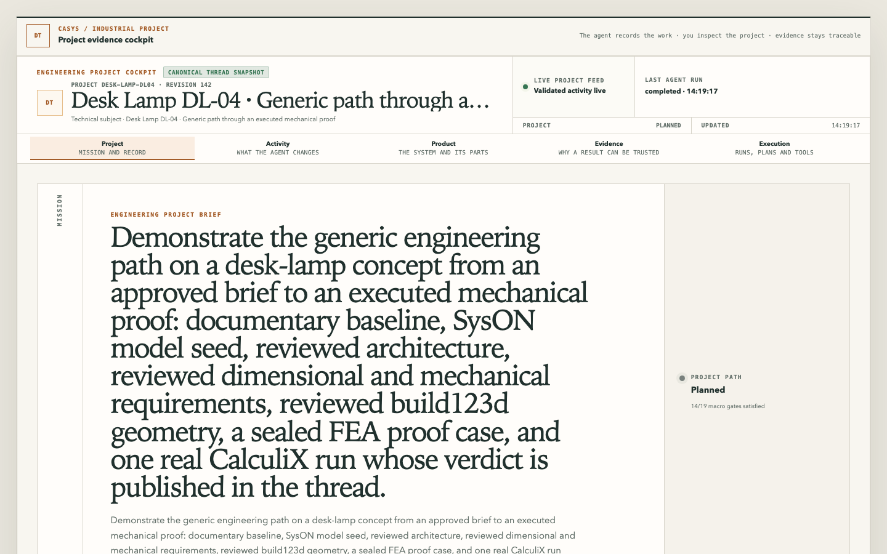
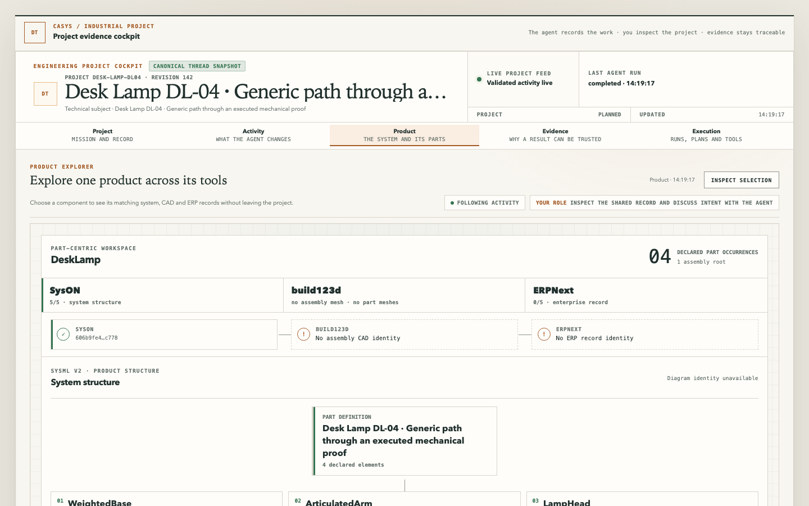
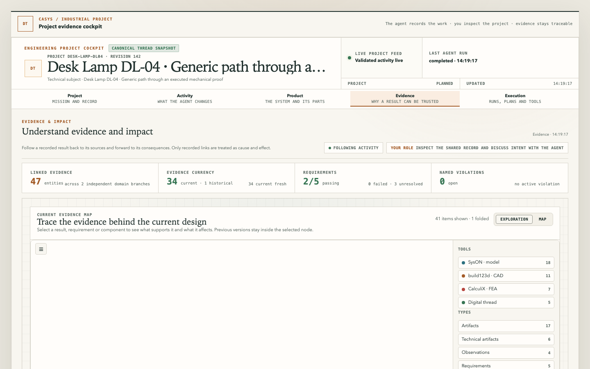

# Tutorial: follow the engineering loop

This is the first Diátaxis tutorial. It shows how a person and a paired agent move from
plain-language intent to inspectable evidence, using the native Workbench as a
**read-only** dossier.

It does not teach CAD, SysML, or FEA. It teaches the loop the product actually runs.

## What you will see

One cockpit, five spaces, one conversation:

| Space         | Job                                                       |
| ------------- | --------------------------------------------------------- |
| **Project**   | Mission, approved brief, phase gates, “what needs review” |
| **Activity**  | Live lineage feed: what the agent just persisted          |
| **Product**   | One physical part across SysON, CAD, ERP identities       |
| **Evidence**  | Full graph, requirements, verdicts, named violations      |
| **Execution** | Runs, registered work items, contributing systems         |


Focused generic candidate `desk-lamp-dl04` (revision 142). Project is the mission and
approved brief. Activity is the live lineage feed. Neither is a command surface.




The person never types a provider tool name. The agent never confirms its own proposal.
The page never starts a solver.

## 0. Start the surfaces

```bash
docker compose up -d          # providers; SysON UI on :8180
npm --prefix src/ui ci
npm --prefix src/ui run build
deno task start               # MCP :3020
deno task preview:thread      # cockpit :5173
```

Connect the agent to `http://127.0.0.1:3020/mcp`. Open `http://127.0.0.1:5173/`. With no
cockpit focus the page waits; it does not invent a project.

A focused generic vehicle already on disk is `desk-lamp-dl04`. It is useful to learn the
five spaces. A CalculiX `@2` receipt is only a captured, reread Thread revision (local
`state/local/`, gitignored), never an `@1` relabel.

A **new** live project on the behave branch only:
[Run the behave loop from zero](../how-to/run-the-behave-loop-from-zero.md).

## 1. Create or resume a project

In the conversation the agent calls `project_start` with the person’s plain-language
intent. The project exists from that moment as an immutable schema-3.0 revision. Then
`cockpit_focus_set` points the Workbench at that project id.

**Project** now shows a living brief, not a SysML model. Treat it as intent.

## 2. Refine the brief, then freeze it

The agent asks one understandable question at a time (`project_question_propose` /
`project_answer_record`), then `project_brief_propose`.

The person confirms the **exact** brief in chat. That is `project_brief_confirm` (signed
MRTR). The cockpit projects the confirmed brief. It is still not a model.

## 3. Publish a plan, then append the seed

`project_plan_publish` may contain only unexecuted planning work. The SysON container
seed **must not** be in that initial plan.

After the brief is canonical:

1. Human-approved `baseline.from-approved-brief@1` writes documentary Thread r1. No
   provider is called.
2. A later `project_change_append` introduces `architecture.seed-syson-model@2` with its
   required decision in the **same** append.
3. Human approves. Agent queues and executes. r2 is a **blank container identity**, not
   an architecture.

See [sequence a SysON seed](../how-to/sequence-seed-work-item.md) if this ordering is
violated.

## 4. Architecture, requirements, geometry, proof

From r2 the generic route continues only through registered operations:

```text
model.write-architecture@1     # server-rendered SysML → SysON
model.write-requirements@1     # integer scalars → SysON
design.write-geometry@1        # seal a reviewed draft (legacy MCP path)
  or compile.seal-admission@1 + design.execute-build123d@1  # isolated draft
verify.seal-proof-case@1       # seal the proof declaration
verify.run-fea-static-proof@2  # recorded CalculiX + SysON oracle
```

A parallel, provider-free slice exists for agent-authored closed-subset SysML: capture →
preview → `model.seal-architecture-sysml@1`. That seal writes a Thread document and
**does not** insert into SysON. See
[author architecture SysML](../how-to/author-architecture-sysml.md).

The first two writes need not be typed by hand. `project_brief_architecture_review` and
`project_brief_requirements_review` compile the approved brief into their exact
parameters and record which brief item each value came from. See
[compile brief parameters](../how-to/compile-brief-parameters.md).

Every consequential step is: append work + decision → propose → human MRTR → queue →
execute. The agent supplies no provider name, tool, path, or SysML text on the renderer
path.

Do not type `sensitivity.case.*`. Call
`project_sensitivity_study_seal_review` first — catalog id and the current
Thread admission become the seal parameters. `desk-lamp-dl06` is
`catalog-absent` until a reviewed template exists. How-to:
[Compile sensitivity-study parameters](../how-to/compile-sensitivity-parameters.md).

After a sealed sensitivity study, check the join **before** queueing an
evaluation. `project_sensitivity_base_evaluation_review` is ready only when
each study metric Object.is-equals one Thread requirement. Historical
`desk-lamp-dl05` r16 published `assembly_max_*` against Thread
`maxDisplacement` / `maxVonMises` — that is `UNLINKED`, not a mapping the
agent may invent. A later isolated reseal on that atelier joined. A new
project starts at
[Run the behave loop from zero](../how-to/run-the-behave-loop-from-zero.md).
Proof-run `@2` evaluations stay a different authority.

`verify.evaluate-sensitivity-base@1` then asks SysON to evaluate the
`sensitivity-base-<metric>-<digest>` observations. Only a **fail** of those
evaluations can authorize `project_vector_correction_review` /
`design.apply-vector-correction@1`. That seal is not a CAD loop and does not
rewrite a Build123d literal. `compile.capture-corrected-source@1` substitutes
the signed `z*` into the parent admission source.
`project_corrected_admission_review` then feeds the existing
`compile.seal-admission@1` / `design.execute-build123d@1` / proof steps. Each
stays its own MRTR.

The STEP then has **three** judgement branches: behave (this tutorial and the
post-proof walk), make (measured DFM), buy (BOM / cost, not registered yet).
They share the geometry identity, not verdicts. Measured DFM is
`industrialize.seal-dfm-case@1` then `industrialize.run-dfm-checks@1` on
canonical `design.write-geometry@1` STEP only. Isolated geometry is not a DFM
target. Do not open make or buy to complete a behave head.

Exact ids, the local r16 facts, and the fail-closed exits:
[Walk the post-proof loop](../how-to/walk-the-post-proof-loop.md).

## 5. Read the cockpit, do not command it

On **Project**, read the brief and the phase gates. “Gate satisfied” means that work
item completed, not that the product is certified.

On **Activity**, leave **Follow live** on. Cards are persisted facts. Select one to see
upstream evidence and downstream impact. The feed is not the agent’s private reasoning.

On **Product**, a missing CAD or ERP identity is a missing reviewed binding. Do not
invent a join from a part name.



On **Evidence**, a `fail` verdict with named violations is valid published truth. Do not
hide it. `unresolved` requirements stay unresolved.



On **Execution**, inspect the run journal. A `queued` run can still be cancelled with
signed human confirmation. A completed run is replayed from CAS, never blindly
re-dispatched.


## 6. What this tutorial does not prove

Opening the page does not run FEA, Modelica, or SysON. A documentary baseline is not a
system model. A SysON seed is not an architecture. An isolated Build123d execution is
not canonical geometry. A `succeeded` Modelica run is not a requirement verdict.

When in doubt, read [agent workspace](../reference/agent-workspace.md) before calling a
tool that looks similar to another.
